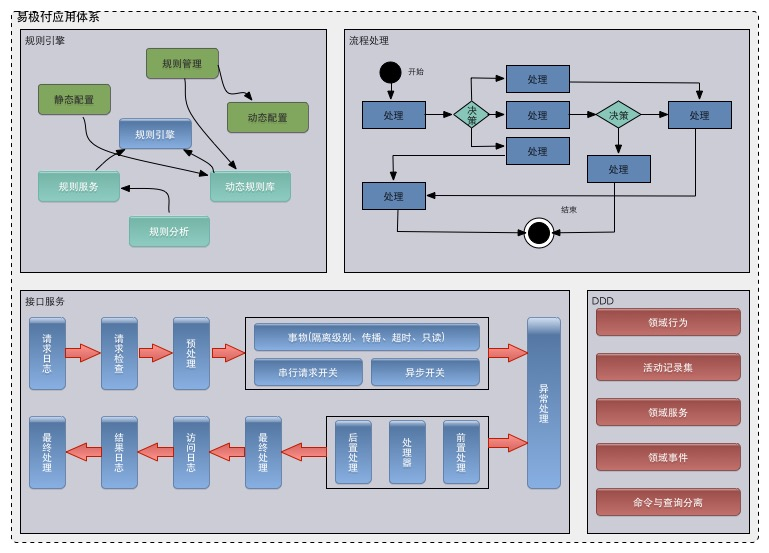
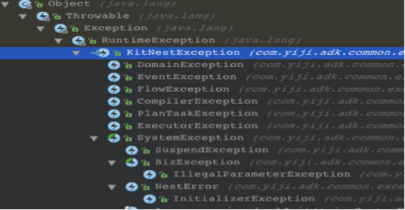
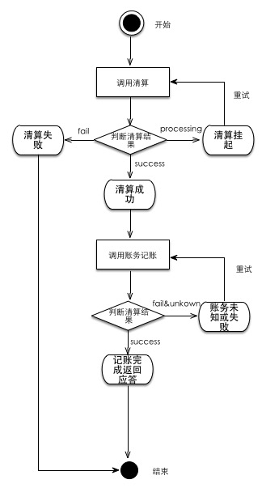
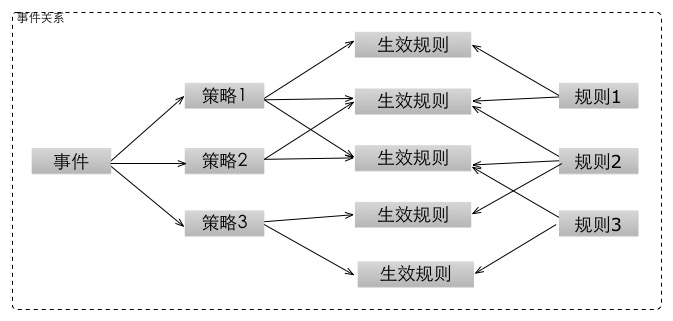

## Application-Developer-Kit使用手册

### 目录
* [1. 设计背景](#1.)
* [2. 建设目标](#2.)
* [3. 配置说明](#3.)
* [4. 历史修订记录](#4.)
* [5. 执行容器](#5.)
	* [5.1 接口服务设计](#5.1)
	* [5.2 将服务提供实现委托给ActivityExecutorContainer执行容器](#5.2)
	* [5.3 编写InvokeService进行业务实现](#5.3)
	* [5.4 @Invoke详解](#5.4)
	* [5.5 ActivityExecutorContainer配置详解](#5.5)
	* [5.6 执行容器异常处理及错误应答构建](#5.6)
	* [5.7 执行容器标准异常体系结构](#5.7)
	* [5.8 执行容器默认异常处理与应答转换](#5.8)
	* [5.9 使用DubboServiceAPI](#5.9)
* [6. 活动记录集](#6.)
	* [6.1 领域模型包组织结构](#6.1)
	* [6.2 配置活动记录集](#6.2)
	* [6.3 使用活动记录集进行业务组装](#6.3)
	* [6.4 活动记录集API说明](#6.4)
* [7. 事件总线](#7.)
	* [7.1 如何使用NotifierBus](#7.1)
	* [7.2 如何配置NotifierBus](#7.2)
* [8. 流程引擎](#8.)
	* [8.1 如何配置流程 ](#8.1)
	* [8.2 节点配置说明](#8.2)
	* [8.3 异常监视器和节点事件监听器](#8.3)
		* [8.3.1 异常监视器](#8.3.1)
		* [8.3.2 流程事件监听器](#8.3.2)
	* [8.4 如何实现流程](#8.4)
		* [8.4.1 定义节点触发器](#8.4.1)
		* [8.4.2 如何实现监听器](#8.4.2)
	* [8.5 流程决策](#8.5)
	* [8.6 配置流程引擎](#8.6)
	* [8.7 流程引擎API](#8.7)
	* [8.8 重试特性](#8.8)
* [9. 规则引擎(仅支持Oracle)](#9.)
	* [9.1 统一架构模式](#9.1)
	* [9.2 事件模型与Drools](#9.2)
		* [9.2.1 动态加载规则](#9.2.1)
		* [9.2.2 规则刷新带来的问题](#9.2.2)
		* [9.2.3 事件模型数据结构](#9.2.3)
	* [9.3 配置规则引擎适配器](#9.3)
	* [9.4 编辑事件模型](#9.4)
	* [9.5 规则引擎适配器API](#9.5)
* [10. 计划任务](#10.)    
* [11. 附录](#11.)


<h3 id="1."> 1. 设计背景 </h3>
> 随着易极付的发展,内部应用规模的不断扩大，无论是应用类型还是复杂度都在不断增加，常规的“随便搞搞”肯定已经不能很好的解决问题和规范化代码了，现在亟需一整套完整的方法来解决现有的问题。   

<h3 id="2."> 2. 建设目标 </h3>    
> 根据对易极付应用体系的跟踪和总结，目前公司最主要的应用问题由以下几种场景组成。    
   


> * 流程引擎
	* 最初易极付整个处理流程系统仅仅是支付引擎、清算中心以及交易核心，已经演变到各种各样的支撑域、订单系统，此时如果还仅仅是简单的service嵌套service或者单纯的两阶段处理(指令的持久化和处理分别由两个事务完成处理)这种简单搞搞的方式势必造成各种风格的包装器和处理模式出现。由于没有统一的处理模式，各种潜在问题和已发现的问题同样也很难有效的管理和修复。
	* 那么此时应当统一标准，在提供方便的同时约束开发风格，从而达到统一管理和修复的效果。

> * 规则引擎
	* 通常使用规则引擎(drools为例),我们都会有两种使用方式，一种是静态加载执行，每次需要增加新的规则，重新编写DRL文件发布即可，另一种是动态规则，对规则的使用会有一定的约束，但由于其本身较强的动态性，影响一般较小。但是由于动态规则本身存在存储、加载、多机一致性的问题以及配置的复杂性，往往都会出现N多种解决方案 
	* 这里需要解决的问题就是，提供统一的管理控制API，黑盒式的加载和运行方式，并提供控制台DSL的支持。

> * 接口服务
	* 由于易极付是基于SOA架构进行构建的(虽然只有一部分)，所以大部分系统都是以提供接口服务为主的，那么问题来了，每个接口服务除开统一使用相应的RPC框架以外还需要做些什么呢？
	* 从上图可以看到，通常情况下接口服务需要提供正常的请求和应答以外，还需要做不少的事情，那么如果建立统一的处理模式，将各种风格的代码和处理模式都将是一个很好的约束，必定重复的事情，做一次就好了，木有必要人人都来搞一炮。

> * DDD
	* 易极付是一家鼓励大家使用DDD进行系统构建的公司，但是由于DDD本身就是一门比较复杂和系统的方法论，虽然它提供了很完整的设计分析过程和编码实现过程的理论支持，但是采用JAVA语言来完成这件事本身就有些吃力（java持久化标准就是个伪模式）.
	* 这里本着鼓励的原则提供一些尝试性的能力支持，比如：活动记录集、领域事件，但还需要做很多事情和改进，把一些比较难缠的东西解决掉。


<h3 id="3."> 3. 配置说明 </h3>
> 由于易极付的所有应用都是基于Spring开发的，所以Application-Dveloper-Kit是在Spring的基础之上进行开发的，也就是说他们是强依赖的。   

> * 环境要求
	* JDK 1.8.0_X
	* Spring 4.0.2.RELEASE

> 虽然这里并强行要求大家按照[yiji-boot](http://gitlab.yiji/qzhanbo/yiji-boot.git)的方式对bean进行管理（主要是老项目的兼容考虑），但我强烈建议新的项目按照[yiji-boot](http://gitlab.yiji/qzhanbo/yiji-boot.git)的方式对组件和bean进行管理，之前有不少同学吐槽易极付使用spring的方式土的掉渣，这里机会来了，你可以使用[spring4](http://docs.spring.io/spring-boot/docs/current/reference/html/)为你带来屌炸天的装B配置了。

<h3 id="4."> 4. 历史修订记录 </h3>
> 修订内容   |  修订人  |  版本  |  修订时间  | 备注
> ------------- | ------------- | ------------- | -------------   | -------------  
> 迁移app-kit至于application-developer-kit并将组件模块全部拆分、增加yiji-boot整合、变更ibatis为mybatis支持.  |  文弱  |  1.0.0-beta  | 2015/09/28  |
修复流程引擎中的bug  |  文弱  | 1.0.1-beta  | 2015/09/30 | 迁移留下的坑
调整计划任务结构，修复重大bug| 文弱 | 1.0.2-beta|2015/10/22| 全是泪啊~
增强活动记录集，获取SqlSessionTemplate、SupportValidator、NotiferBus能力| 文弱 | 1.0.3-beta|2015/10/22|体验有点差
修复线程池bug，增加测试用例| 文弱 | 1.0.4-beta|2015/10/22|
修复流程引擎事件bug，增加相关测试用例| 文弱 | 1.0.5-beta|2015/12/09|
修复流程引擎中获取File的bug| 文弱 | 1.0.6-beta|2015/12/24|
对api进行jdk1.7版本编译| 文弱 | 1.0.7-beta|2015/12/24|目前全站都是采用jdk1.8进行编译api发生变化需要强制升级，特此兼容。
修复DomainFactory对NotifierBus注入bug| 文弱 | 1.0.7-beta|2016/02/21|话说这个bug之前被其他方式给覆盖掉了，但在整合yiji-boot后出现- -！！。
对biz-executor增加其他事务管理器支持| 文弱 | 1.1.3-beta|2016/02/21|
对biz-executor增加对事物支持可选择回滚机制（notRollbackFor）| 文弱 | 1.1.4-beta|2016/03/17|
修复SystemException中构造器调用super造成的bug| 文弱 | 1.1.6-beta|2016/04/7|
去除ExecuteResult、修改执行容器中end执行不再finally域中，修改finishlog，只打印结果，不高亮状态，出错时通过异常监听器日志查看|文弱 | 1.2.1-beta|2016/04/22|
1：变更mevl版本为易极付内部版本，解决jdk8下的bug；2：修复FlowEngine中的未指定版本时的bug|文弱 | 1.2.4-beta|2016/06/29|
1. rule名称增加版本号，解决版本冲突的bug；2. 所有规则的运行使用statefulSessionWrapper有状态模式，引入对象池缓存生成的session；3. 在加载的时候对默认规则进行渲染，再缓存，方便以后直接使用| 子佳| 1.2.5-beta|2016/07/19|
修改出现内部错误、未知错误时，返回的应答构建为“内部错误”、“未知错误”，而不是之前的Exception.getMessage()|李根|1.2.9-beta|2016/09/06|
1. 在策略表中增加风险类型和策略来源，2. 策略的查询改为行业线和通用策略的查询，3. 修改ruleElement缓存的key值|子佳|1.2.13-SNAPSHOT|2016/09/22|
修复drools中多线程中动态编译规则重复加载的bug|子佳|1.2.19-SNAPSHOT|2016/12/12|
修改规则引擎加载方式为全异步加载，修改没有对应规则时的事件版本加载默认规则，将测试用例修改为对应异步过程|李根|1.2.20-SNAPSHOT|2017/1/29|
1. 执行容器可以不再强制实现dubbo provider特性；2.流程引擎增加定时节点处理；|李根|1.2.24-SNAPSHOT|2017/06/27|


<h3 id="5."> 5. 业务执行器 </h3>
> 业务执行器是一套提供远程服务的一套标准，它旨在为易极付解决内部提供标准统一的流程服务，规避在开发过程中的重复开发为开发者，提供便捷以及进行内部必要流程的规范和约束。

> ***Maven依赖***

> ```
<dependency>
	<groupId>com.yiji.adk</groupId>
	<artifactId>biz-executor</artifactId>
	<version>#{adk.version}</version>
</dependency>
```

<h4 id="5.1"> 5.1 接口服务设计</h4>
> 以易极付的工程结构为例，我们都将对外暴露的服务放在facade或者api模块，以com.yiji.项目名称简写开头，如：com.yiji.xxx.service.api进行包结构组织.   

> ***例如: 充值接口定义***   

> * com.yiji.core.pay.service.api    

> ```
//充值接口
public interface DepositService {
	//代扣服务
	DeductResult deduct(DeductOrder order , OperationContext operationContext)
	//网银服务
	EBankResult ebank(EBankOrder order , OperationContext operationContext)
}
```

> * com.yiji.core.pay.service.enums   

> ```
//交易码
public enum PayCode{
	DEPOSIT("DEPOSIT" , "充值") ，
	DEPOSIT_BACK("DEPOSIT_BACK" , "充退")
	WITHDRAW("WHITDRAW" , "提现") ,
	DISHONOURED("DISHONOURED","退票") ;
}
//子交易码(充值)
public enum DepositCode{
	DEDUCT("DEDUCT","代扣"),
	EBANK("EBANK","网银");
}
```

> * com.yiji.core.pay.service.result   

> ```
//网银应答
public class EBankResult extends ExecuteResult{
	private EBankResultInfo info ;
	//……
}
```

> * com.yiji.core.pay.service.info

> ```
//网银应答信息
public class EBankResultInfo extends Serializable{
	private String       orderNo;   //订单编号
	private String       reserveField; //预留域，透传、透存，原样返回       
	private PayCode      payCode;
	private DepositCode  depositCode;
	private Timestamp    payTime;  //业务支付时间
	private Timestamp    rawAddTime; //系统存储时间
	private Timestamp    rawUpdateTime; //系统最后更新时间
	//……
}
```

> * com.yiji.core.pay.service.order   

> ```
public class EBankOrder extends OrderBase{
	private String       orderNo;   //订单编号   
	private String       reserveField; //预留域，透传、透存，原样返回
	private PayCode      payCode;
	private DepositCode  depositCode;
	private Timestamp    payTime;  //业务支付时间
	private Money        amount;
	//……
}
```


<h4 id="5.2"> 5.2 将服务提供实现委托给ActivityExecutorContainer执行容器</h4>
> 在业务执行器中，所有的业务代码入口都是com.yiji.adk.biz.executor.ActivityExecutorContainer,也是唯一的方式。
> 按照易极付的模块标准，接口服务的提供者位于biz模块，以com.yiji.项目简写开头,如：com.yiji.xxx.service.provider进行包结构组织.   

> ***例如：充值接口服务提供实现(dubbo提供)***    

> * com.yiji.pay.service.provider

> ```
@Service(group = "c.y.c.pay.s.p.dsp" , version = "1.0")
public class DepositServiceProvider implement DepositService{
	@Autowire
	private ActivityExecutorContainer activityExecutorContainer ;
	public EBankResult ebank(EBankOrder order , OperationContext operationContext){
		return activityExecutorContainer.accept(
			order, "deposit_ebank",
			OperationContext.build(
				"pay",
				"pay", 	
				OperationTypeEnum.test,
				BusinessTypeEnum.TEST
			)
		);		
	}
}
```

> ***方法说明：public <Param, R extends ExecuteResult> R
accept(Param parameter,                                                String serviceName,
OperationContext operationContext))***    

> * R：泛型应答结果。
> * Param parameter：请求参数，通常情况为OrderBase的子类，如果不是将不会进行基于jsr303的请求参数验证和注册码的验证(交易码、请求码)。
> * String serviceName: 具体执行器的服务名称,容器通过该名称对请求进行路由，见[5.4@Invoke详解](#5.4)
> * OperationContext operationContext：操作上下文，访问日志将基于此进行打印。


<h4 id="5.3"> 5.3 编写InvokeService进行业务实现</h4>
> 执行容器通过服务名称进行路由，那么就应当提供相应的执行服务了。

> ```
@Invoke(serviceName = "deposit_ebank")
public class EBankDepositInvoke extends InvokeServiceAdapter<EBankOrder, EBankResult>{
	@Override
	public void before(ServiceContext<EBankOrder, EBankResult> serviceContext) {
		EBankOrder order = serviceContext.getParameter();
		DepositInstruction instruction = new DepositInstruction();
		Copier.copy(instruction,order);
		serviceContext.setEntityObject(instruction);
	}
	@Override
	public void invoke(ServiceContext<EBankOrder, EBankResult> serviceContext) {
		//后续处理....
	}
}
```

> 这样一个完整的服务提供过程就完成了，当然这是最简单的方式，也是最基本的功能，在这里唯一需要注意的是@Invoke注解中提供的serviceName必须和执行容器路由时使用的一致，否则将报告com.yiji.adk.common.exception.ExecutorException错误。

<h4 id="5.4"> 5.4 @Invoke详解</h4>
> @Invoke注解可以开启或关闭很多功能，这也是执行容器用于规范和便捷开发的主要目的，下面是该注解可以进行的配置项。    

> * ***serviceName***: 服务名称，并且需要全局唯一，用于执行容器路由使用，如果出现重复，将会产生覆盖，该参数为必填选项。

> * ***logName***:在执行容器中用于打印请求日志，访问日志，结束日志的Appender名称，默认将会使用容器名称，该参数为选填。

> * ***validateGroup***: JSR303的分组选项，默认使用javax.validation.groups.Default.class ，该参数为选填。

> * ***entityType***：领域模型自动构建选项，这里自动构建的领域模型具备[6. 活动记录集](#6.)的全部能力，默认情况下为Void.class类型，该参数为选填。

> * ***isEntityInjectSpringBeans***：由容器自动创建的领域模型，在特殊情况下，可能需要将Spring管理的Bean进行注入，但是这个选项目前来说比较消耗性能，默认是关闭的，在后面的版本中将采用AspectJ的LTW方式进行实现，用于改善性能，该参数为选填。

> * ***isAsync***：容器是否异步执行该执行器，默认为同步执行，该参数为选填。

> * ***transactionAttribute***：事物支持，该支持完全参照Spring事物管理实现，通过com.yiji.adk.biz.exe
cutor.annotation.TransactionAttribute注解对事物进行描述。
	* ***isTx***：是否开启事物，默认为开启，该参数为选填。
	* ***propagation***：事物传播机制，默认为TransactionDefinition.PROPAGATION_REQUIRED，该参数为选填。
	* ***isolation***:事物隔离级别：默认为TransactionDefinition.ISOLATION_DEFAULT，表示采用数据库默认级别，该参数为选填。
	* ***timeout***:数据库操作超时时间，默认为TransactionDefinition.TIMEOUT_DEFAULT，使用数据库默认，该参数为选填。
	* ***isReadOnly***:是否为只读,这里实际上是设置java.sql.Connection#setReadOnly(isReadOnl
	y)方法，在查询中应当优先选择这个属性，但是在有变更数据行为的请求中应当避免，否则会导致数据库事物失效，该参数为选填。
	* ***notRollbackFor***: 异常过滤列表，支持出现异常时继续提交事务（SuspendException及其子类会自动忽略）。

> * ***lock***：是否对该请求上锁，做串行处理，这里需要用到com.yiji.adk.active.record.module.DBPlugin#lock和lockNoWait的具体实现，最简单的方式是直接采用数据库的锁能力来完成，相对也比较简单。后续版本会将其移除，采用统一的zookeeper实现,默认值为false，该参数为选填。   
	* ***isLock***: 是否上锁，默认为false，选填参数。
	* ***isNoWait***: 上锁时是否等待阻塞，默认为false，isLock为false时该参数无效，选填参数。
	* ***policy***:使用策略，属于应用属性，由应用自身决定策略，可以是没有，默认为：“”,选填参数。
	* ***module***:对应锁模块，属于应用属性，系统可以没有模块也可以有，默认为：“”,选填参数。
	* ***lock***:对应锁名称，属于应用属性，默认为：“”,选填参数。

> ***一个更完整的EBankDepositInvoke示例***   

> ```
//充值指令聚合根
@SqlBinder(insert="deposit_instruction_insert",update="deposit_instruction_update",delete="deposit_instruction_delete")
public class DepositInstruction extends AggregateRoot{
	//……
}
@Invoke(
        serviceName = "ebank_deposit", logName = "payment" ,entityType = DepositInstruction.class,
        isAsync = false,isEntityInjectSpringBeans = true,
        lock = @Invoke.SerialLock(
                isLock = true,isNowaite = true,policy = "standard",module = "ebank_deposit",lock = "deposit_lock"
        ),
        transactionAttribute = @Invoke.TransactionAttribute(propagation = TransactionDefinition.PROPAGATION_REQUIRES_NEW)
)
public class EBankDepositInvoke extends InvokeServiceAdapter<EBankOrder, EBankResult>{
	@Autowire
	private DepositInstructionRepository depositInstructionRepository ;
	@Override
	public void before(ServiceContext<EBankOrder, EBankResult> serviceContext) {
		DepositInstruction depositInstruction = serviceContext.getEntityObject();
		EBankOrder order = serviceContext.getParameter();
		depositInstruction.convertFrom(order);
		//DepositInstruction depositInstruction = serviceContext.convertEntity(String ... ignore); 下个版本实现
	}
	@Override
	public void invoke(ServiceContext<EBankOrder, EBankResult> serviceContext) {
		DepositInstruction depositInstruction = serviceContext.getEntityObject();
		//幂等性处理
		try{
			//利用活动记录集的能力
			//创建业务流水号、并覆盖掉覆盖无意义ID,流水号采用A001作为前缀
			depositInstruction.generateBizNo("seq_pay_common",true,"A001");
			//插入数据库
			depositInstruction.insert();
		}catch(DuplicateKeyException e){
			if(serviceContext.getLogger().isWarnEnabled()){
               serviceContext.getLogger().warn("重复提交EBankOrder ={}", eBankOrder);
			}
			//根据唯一约束激活聚合跟并返回查询结果。
			serviceContext.setEntityObject(
				depositInstructionRepository.active(serviceContext.getParameter())
			);
			return ; //退出，执行after操作
		}		
		//其他业务操作……
	}
	@Override
	public void after(ServiceContext<EBankOrder, EBankResult> serviceContext){
		DepositInstruction depositInstruction = serviceContext.getEntityObject();
		EBankResultInfo info = new EBankResultInfo();
		//赋值操作……
		serviceContext.result().setEBankResultInfo(info);
	}
}
```

<h4 id="5.5"> 5.5 ActivityExecutorContainer配置详解</h4>
> 在了解了Invoke的具体使用方法后，我们应该来了解一下整个执行容
器的配置和依赖关系了。    

> 基于spring3.x的配置方式。   


> ```
<bean id="activityExecutorContainer" class="com.yiji.adk.biz.executor.ActivityExecutorContainer"
	p:dbPlugin-ref="dbPlugin"
	p:domainFactory-ref="domainFactory"
	p:threadPoolTaskExecutor-ref="executorAsyncThreadPool"
	p:transactionManager-ref="transactionManager"
	p:registryCodeVerify-ref="registryCodeVerify"
	p:monitor-ref="exceptionMonitor">
</bean>
```
> ***参数说明：***   

> * ***DBPlugin:*** 使用者需要实现DBPlugin为执行容器提供获取序列、时间、非阻塞上锁、上锁阻塞的能力，在活动记录集中同样需要该组件的用户实现，后续版本将对锁部分去除，并提供zookeeper实现，此参数为必选项。   
***例如：***


> ```
public class DBpluginImpl implements DBPlugin {
	private SqlSessionTemplate sqlSessionTemplate;
	public DBpluginImpl(SqlSessionTemplate sqlSessionTemplate) {
		this.sqlSessionTemplate = sqlSessionTemplate;
	}
	@Override
	public Timestamp currentTimestamp() {
		return sqlSessionTemplate.selectOne("CURRENT_TIMESTAMP");
	}
	@Override
	public Long nextVar(String sequenceName) {
		if (StringUtils.isBlank(sequenceName)) {
			throw new DomainException("sequence_name为空");
		}
		return (Long) sqlSessionTemplate.selectOne("DEFAULT_SEQUENCE", sequenceName);
	}
	@Override
	public void lock(String policy, String module, String lockName) {
		//可以采用zookeeper完成、简单方法可以创建一张db_lock的表
		//将policy、module、lock作为其中的列元素，上锁时直接使用
		//select * from db_lock where policy=? and module=? and lock=? for update即可。
	}
	@Override
	public void lockNoWaite(String policy, String module, String lockName) {
		//如果使用mysql，就别考虑了……
	}
```

> * ***domainFactory：***这个参数是活动记录集的工厂方法，可以让@Invoke.entityType属性配置的领域对象具备活动记录集的能力，该参数为选填，当不存在时@Invoke.entityType配置自动产生的领域对象将不具备任何活动记录集能力。

> * ***threadPoolTaskExecutor:***异步处理线程池，非必填参数，当为空时异步处理将转为同步处理，并且没有任何警告和报错。


> * ***transactionManager:*** 事物管理器，由于adk并没有打算对orm框架进行广义上的适配，所以只能使用DataSourceTransactionManager也就是ibatis和mybatis以及jdbctemplate的事务管理器实现，若为空，则忽略事物及并行处理。

> * ***registryCodeVerify*** 注册码验证（不知道为什么当时抽风就取了这名字），对于有请求码、交易码的系统，通常会进行验证，如：转账接口不能接受充值交易码，该参数需要实现com.yiji.adk.biz.executor.regcode.RegistryCodeVerify接口，当然如果你没有验证需求，该参数可为空，为非必填参数

> * ***monitor:*** 异常监听器[(执行容器异常处理及错误应答构建)](#5.6)，在执行容器中，通常不需要捕获任何异常，一般由异常监听器对所有的错误进行处理，默认情况使用标准的监听com.yiji.adk.biz.executor.monitor.StandardExceptionMonitor，该参数为选填。

> _***基于yiji-boot(spring-boot)的application.properties参考配置。***_

> \#yiji-boot-starter-jdbc(mybatis依赖)    
> yiji.ds.url=jdbc:oracle....	  	
> yiji.ds.username=axxa  
> yiji.ds.password=bxxb  

> \#yiji-boot-starter-mybatis(active-record依赖)  
> yiji.mybatis.enable=true  

> \#active-record(biz-executor可选依赖)  
> yiji.adk.activerecord.enable=true  

> \#biz-executor完整配置项  
> yiji.adk.executor.enable   			#是否启用此组件(默认:false)  
> \#yiji.adk.executor.threadPoolBeanName			#外部线程池Spring Bean名称   

> \#异步事件开关，线程池是否生效以此开关为准。即便外部已经配置了线程池在关闭的情况下仍然会忽略(默认：true)如需要使用自定义线程池，只需存在相应的spring定义即可，容器不会单独创建线程池。  
> yiji.adk.executor.asyncEnable		

> yiji.adk.executor.corePoolSize		#核心线程数(默认:2)  
> yiji.adk.executor.maxPoolSize		#最大线程数(默认:10)  
> yiji.adk.executor.keepAliveSeconds	#限制线程保持时间(默认:300秒)  
> yiji.adk.executor.queueCapacity		#线程队列容量(默认:50)  

> 注意：  
> com.yiji.adk.active.record.module.DBPlugin的具体实现为必须提供!  

> 需要使用全局线程池时，可以通过普通的Bean方式定义（MonitoredThreadPool），会自动覆盖掉默认配置。    

> com.yiji.adk.biz.executor.regcode.RegistryCodeVerify和  
> com.yiji.adk.biz.executor.monitor.StandarExceptionMonitor  
> 可以通过普通的Bean方式定义，会自动覆盖掉默认配置。  

<h4 id="5.6"> 5.6 执行容器异常处理及错误应答构建</h4>
> 在之前的示例代码中是不涉及异常处理的（木有try-catch），这是因为业务处理容器对系统中出现的异常进行了深度封装，下面看一个基于spring3.x的完整示例。

> ```
<bean class="com.yiji.adk.biz.executor.monitor.StandardExceptionMonitor" id="exceptionMonitor"
          c:logName="SYS_LOG"
          c:systemName="SecurityCore"
          p:configs-ref="configs"/>
<util:list list-class="java.util.ArrayList" value-type="com.yiji.adk.biz.executor.monitor.ExceptionProcessorConfig"
               id="configs">
        <bean class="com.yiji.adk.biz.executor.monitor.ExceptionProcessorConfig"
              p:mvelScript="throwable instanceof com.yiji.adk.common.exception.KitNestException"
              p:ordered="1">
            <property name="processor">
                <bean class="com.yiji.adk.biz.executor.monitor.KitNestExceptionProcessor" p:printStackTrace="true"/>
            </property>
        </bean>
        <bean class="com.yiji.adk.biz.executor.monitor.ExceptionProcessorConfig"
              p:mvelScript="1==1"
              p:ordered="1">
            <property name="processor">
                <bean class="com.yiji.adk.biz.executor.monitor.UnkownExceptionProcessor" p:printStackTrace="true"/>
            </property>
        </bean>
</util:list>
```

> 这是使用com.yiji.adk.biz.executor.monitor.StandarExceptionMonitor默认异常监听器的完整配置，通常情况下这不是必须的，默认的配置可以适配绝大部分的需求。  

> * ***logName(构造器参数):***系统打印日志的名称，有时候我们会将错误日志与普通日志分开进行打印，便于查看问题。
* ***systemName(构造器参数):***系统名称，用于日志打印。
* ***configs：*** 业务执行容器，采用的是过滤器的方式对异常进行处理，也就是说一个异常的抛出，对于监视器而言它可能拥有一个或多个的具体处理器对异常进行处理，并且拥有一定的执行顺序，当然一般情况下只需要分类处理即可,具体接口:com.yiji.adk.biz.executor.monitor.ExceptionProcessorConfig。
	*  ***mvelScript:*** 通过表达式来进行异常处理规则的匹配，通常都是采用instanceof之类的语法，当需要特殊处理时可以将mvel容器中的两个入参进行自由组合
		* 原始异常- 参数名：throwable ，类型：java.lang.Throwable。
		* 处理器- 参数名：processor ， 类型：com.yiji.adk.biz.executor.monitor.ExceptionProcessor 。
	*  ***ordered:*** 异常处理器匹配优先级，默认为-1，当数字相同时按配置顺序执行
	*  ***processor:*** 类型为com.yiji.adk.biz.executor.monitor.ExceptionProcessor处理器。

> 在选用StandarExceptionMonitor时，系统会提供默认的异常处理实现。

> ```
<bean class="com.yiji.adk.biz.executor.monitor.StandardExceptionMonitor" id="exceptionMonitor"
          c:logName="SYS_LOG"
          c:systemName="SecurityCore"/>
```
> 此时监视器提供两个默认处理器

> * com.yiji.adk.biz.executor.monitor.KitNestExceptionProcessor
	* 优先级为：“1”，最先进行异常规则匹配。
	* 规则表达式：throwable instanceof com.yiji.adk.common.exception.KitNestException
	* 说明：在默认异常处理器下，该处理器只对KitNestException及其子类进行监视和处理，并不对其他的异常进行处理，见[执行容器标准异常体系结构](#5.7) 。
* com.yiji.adk.biz.executor.monitor.UnkownExceptionProcessor
	* 优先级：“2”，最后进行异常规则匹配。
	* 规则表达式：1==1
	* 说明：在优先级为“1”的处理完成了KitNestException的异常处理之后，会对其他所有的异常进行统一处理，不会允许除Error错误以外的其他异常抛出外部，并会对所有的请求做应答出错处理，见[执行容器默认异常处理与应答转换](#5.8)。

<h4 id="5.7"> 5.7 执行容器标准异常体系结构</h4>
> 在整个ADK中所有的异常都继承于com.yiji.adk.common.exception.KitNestException,它是一个运行时异常（RuntimeException）的子类，并且内部所有的组件同样继承于它，当然这里也是包含执行容器的。   
> 在执行容器中，提供了基于业务的异常体系支持，虽然这是非必要的，但我强烈的建议你使用它，下面我们来看一下在执行容器中提供的一行体系结构。

> 

> 在执行容器中，如果因为配置的问题的，一般都会抛出ExecutorException错误，主要用于系统启动检查，但是在运行过程中，也就是业务执行过程中的错误它是通过com.yiji.adk.common.exception.SystemException提供支持的，并且它始终强调***“错误的应答，应当是异常引起的，且无论是业务异常还是系统的内部错误”***，下面来看一下具体的支持方式。   

> * ***SuspendException:*** 系统挂起错误，造成这个错误的是系统返回了，无法判断的结果（银行就经常这个屌脸），或因为网络抖动调用外部系统超时引起，需要注意的是该异常体系下所有子类不会引起事务回滚。

> * ***BizException:*** 业务错误，任何提供服务的系统都会存在因为某种业务规则造成提供的服务失败，那么这个时候我们就可以称为业务异常，例如：
	* 请求参数为必填时，请求方却设置了null值，那么将报告请求参数出错。
	* 进行转账请求的时候，由于转出金额>当前余额，那么将报告余额不足。
	* 进行充值请求的时候，由于没有查询到会员账户信息，那么将报告用户不合法。
	* 当进行充退申请的时候，由于不存在充值流水记录或者时间超限，那么将报告非法的充退。

> * ***NestError:*** 系统在运行时，总会有一些未知的错误发生，它也许是自身bug造成的，也可能是其他中间件造成，这一类的错误，我们可以统称内部错误，如果划分的更细腻一些，可以在划分出，“未知错误”和“系统错误”，分别表示bug引起和其他中间件引起，比如：
	* 系统自身由于逻辑错误，出现空指针异常，应视为bug引起。
	* 当数据库不能获取连接，或者不能提交事务等，应视中间件引起。


<h5 id="5.8"> 5.8 执行容器默认异常处理与应答转换</h5>
> 在使用SystemException及其子类作为系统处理标准的同时，异常监视器也提供了错误到应答的转换，执行容器强制使用com.yiji.adk.api.ExecuteResult及其子类作为对外统一应答，在结构上应答对象和异常的设计有部分共同属性，主要的目的是用于转换，也就是说在异常中是可以反馈应答中的部分结果，它主要通过一个方法5个属性来完成这件工作。

> * _***SystemException#transport(ExecuteResult)：***_  通过该方法将异常转换为应答result，当然不适用执行容器提供的异常体系同样可以完成这份工作，但这将增加不少工作量。

> * _***com.yjf.common.lang.result.Status status：***_ 执行状态，这和我们之前使用的没有任何区别，用于表示本次请求的状态。

> * _***String code：***_ 在易极付体系内都遵循的错误码标准;

> * _***String description：***_ 业务执行描述，如果说错误码是给用户看的，那么描述就是给程序员看的 。
> * _***String source：***_ 出现错误时，应当存在出错系统源(易极付规范不存在这点，可选参数)，处理成功时，该字段应当为空 。
> * _***String verbose：***_ 出错详情，这里是对业务描述的一种补充(易极付规范不存在这点，可选参数)，例如：description=单据检查出错、verbose=userID不能为空；description=买家不存在、verbose=查询会员失败。处理成功时，该字段应当为空 。

> 另外，执行容器提供了两个默认的异常处理。

> * KitNestExceptionProces
	* 捕获并处理KitNestException全部子类,分别对SystemException和KitNestException的其他子类进行处理.   
	* 对SystemException及其子类，将通过SystemException#transport(ExecutResult)进行错误与应答的转换。   
	* 对KitNestException的其他子类，则将直接构建出错应答

> * UnkownExceptionProcessor
	* 对所有KitNestException体系以外的异常进行错误应答处理。
	* 对所有的java.lang.Error错误直接抛出，使用dubbo服务的客户端，此时将接受到Error错误，这种处理方式也许某些场景不太合适，但对绝大部分场景来说是合适的，如果有什么其他的意见，大家可以找我讨论。

> ```
注意：
1. 当抛出异常时，我们可以通过重写SystemException#initStatus方法来决定是否转变为错误应答。
2. 当系统遇到了下层系统的错误，而无法识别时，我们仍然可以通过SystemException错误来透传下层错误描述以及错误码，只需要将错误指向下层系统即可。
```

<h5 id="5.9"> 5.9 使用DubboServiceAPI</h5>

通过使用DubboServiceAPI,可以不用自己写provider实现，adk会自动生成

1.facade依赖adk的api包
2.配置元数据路径 yiji.adk.executor.providerMetaPath=com/cb/xx/facade,com/cb/yy/facade
3.invoke servicename=服务名.方法名,比如 XXXService.xxxMethod


<h3 id="6."> 6. 活动记录集 </h3>
> 由于java持久化规范本身的问题，对于DDD的实践本身就是件比较困难的事情，然而总有些事，是需要我们去尝试，在这里我们首先对愿意尝试使用DDD的同学提供一个小组件，一个基于mybatis的活动记录集实现，并提供领域事件的支持，当然，一个优雅的活动记录集实现通常都伴随着一个ORM的实现，但在这之前，我们首先会考虑对CQRS的支持，如果时间允许，同时也需要，那么我们将会设计并实现一套完整的框架以对活动记录集、ORM、CQRS、领域事件进行完整的支持。

> 这里我们不对DDD的基本概念进行介绍，仅仅针对工具的使用进行描述，对DDD感兴趣的同学，可以自行翻阅资料。

> ***Maven依赖***

> ```
<dependency>
	<groupId>com.yiji.adk</groupId>
	<artifactId>active-record</artifactId>
	<version>${adk.version}</version>
</dependency>
```

<h4 id="6.1"> 6.1 领域模型包组织结构</h4>
>  在使用领域模型的项目中，应当添加domain模块(maven module),其包组织结构为com.yiji.xxx.domain进行包组织，另外，dal模块可以继续沿用之前的方式继续保留，或者去除dal模块为com.yiji.xxx.domain增加dal层，其他的包可以按一下推荐方式建包。


> * com.yiji.xxx.domain.aggregateroot
* com.yiji.xxx.domain.entity
* com.yiji.xxx.domain.value
* com.yiji.xxx.domain.dal（可选）
* com.yiji.xxx.domain.repository
* com.yiji.xxx.domain.service
* com.yiji.xxx.domain.typehandler

> ***例如: 充值指令***   

> ```
//聚合根
package com.yiji.xxx.domain.aggregateroot;
@SqlBinder(insert="deposit_instruction_insert",delete="deposit_instruction_delete",update="deposit_instruction_update")
public class DepositInstruction extends AggregateRoot{
	/** 订单号（贯穿全局） */
	private String orderNo;
	/** 数据游标 */
	// mysql查询时游标界定范围，提高大数据查询效率
	// oracle均匀分布数据（索引聚簇因子低），范围抓取、同步时意义重大
	private long cursor;
	/** 指令状态 */
	private Status status;
	/** 指令执行结点 */
	private String actionNode;
	/** 外部数据域（原样返回，仅存储使用） */
	private String externalMetadata
	/** 扩展上下文 */
	private Map<String,String> extensionContext = Maps.newHashMap();
	/** 业务描述 */
	private String bizDescription ;
	/** 业务时间 */
	privaite Timestamp bizTime;
	/** 创建时间 */
	private Timestamp rawAddTime ;
	/** 最后更新时间 */
	private Timestamp rawUpdateTime;
	/** 运行时摘要信息 */
	private String memo;
	/** 通知任务 */
	private NotifyTask notifyTask;
	//充值指令相关信息流
	//冗余部分行业产品信息
	//易极付全局信息
	//调用方配置信息
}
//实体定义
public class NotifyTask<T extends OrderBase> extends EntityObject{
	/** 无意义序列 */
	private long identity;
	/**
	* 唯一查询键（由系统提供能够确定唯一的查询维度，按MD5存储）
	* 例如：orderNo(023)、accountNo(123xxx)、direction(debit)
	* transCode(400001)、subTransCode(A001)
	* select md5('023、123xxx、debit、400001、A001') from dual;
	* 87E1C353A49207EB9D5FE2C3C452CBF9
	*/
	private String uniqueKey;
	/** 系统域名 */
	private URL sysUrl;
	/** 通知主体 */
	private NotifParty ;
	/** 通知数据 */
	private T order;
	/** 通知状态 */
	private Status status;
	/** 最后一次返回详情(最大256) */
	private String detail ;
	/** 重试次数 */
	private int retryCount ;
	/** 最大重试次数 */
	private int maxRetryCount;
	/** 创建时间 */
	private Timestamp rawAddTime;
	/** 最后更新时间 */
	private Timestamp rawUpdateTime;
}  
```

> 以上是一个最简单的领域模型定义示例，其中包含了很多必要参数的推荐定义，完全可以在系统中采用这种方式进行领域模型设计。   

<h4 id="6.2"> 6.2 配置活动记录集</h4>
> 在开始使用活动记录集之前，先来看一下具体配置。   
_***基于spring3.x***_

> ```
<bean id="domainFactory" class="com.yiji.adk.active.record.DomainFactory"
          c:internalSeqCreator-ref="internalSeqCreator"
          c:sqlSessionTemplate-ref="sqlSessionTemplate"
          c:notifierBus-ref="notifierBus"/>
```

> 参数说明  

> * _***SqlSessionTemplate ：***_ 活动记录集是一个基于mybatis的实现，很自然的就会对mybatis产生依赖，该参数为必填。
* _***InternalSeqCreator ：***_ 内部序列生成器，用于获取序列。通常情况下如果使用数据库自增序列，那么可以采用默认的com.yiji.adk.active.record.StandardInternalSeqCreator,如果存在其他的生存方式可以自行实现，比如：通过数据库table来获取，或者利用系统时间种子来获取，该参数为选填，默认为StandardInternalSeqCreator。   
* _***NotifierBus：***_事件总线，见[7.事件总线](#7.)，该参数为选填，默认情况下会产生一个_***关闭异步事件***_的通知总线。

> _***基于yiji-boot配置***_    
\#yijif-boot-starter-mybatis依赖数据源  
yiji.ds.url=jdbc:oracle      
yiji.ds.username=xxoo  
yiji.ds.password=ooxx    

> \#active-record依赖yiji-boot-starter-mybatis    
yiji.mybatis.enable=true

> \#应用对active-record依赖   
yiji.adk.activerecord.enable=true

> 配置领域模型   

> ```
@SqlBinder(insert="account_insert",update="account_update",delete="account_delete")
public class Account extends AggregateRoot {
}
```
> 要使用活动记录集需要领域对象遵循一定的约定。   

> * 需要继承EntityObject或者AggregateRoot。
	* EntityObject:用于定于实体对象，如果决定使用活动记录集，但又不想去使用DDD，那么你可以视你的全部领域对象为实体对象，这和java持久化规范的用法是一致的。
	* AggregateRoot：当你决定使用DDD来进行开发的时候，那就应当仔细的设计出相应的聚合根对象，这个类的定义和EntityObject在本质上没有太多的区别，主要是为了起约定俗成。
> * SqlBinder是一个必须配置的项，用于对mybatis定义的mapper进行sql指定。


<h4 id="6.3"> 6.3 使用活动记录集进行业务组装</h4>
> _***例如：转账服务***_

> ```
@Invoke(serviceName="standard_transfer")
public class StandardTransferInvoke extends InvokeServiceAdapter{
	@Autowire
	private AccountRepository accountRepository;
	@Autowire
	private AccountDomainService accountDomainService;
	@Override
    public void invoke(ServiceContext<StandardTransferOroder , StandardTransferResult> serviceContext) {
		Account payee = accountRepository.active(serviceContext.getParameter().getPayee());
		Account payer = accountRepository.active(serviceContext.getParameter().getPayer());
		//这里让领域服务层来编排业务
		accountDomainService.transfer(payee,payer,serviceContext.getParameter().getAmount());
    }
}
//聚合根仓储(Account)
@Repository
public class AccountRepository{
	@Autowire
	private DomainFactory domainFactory;
	public Account active(String accountNo){
		Account account = domainFactory.newInstance(Account.class);
		if(!account.load(accountNo,"find_by_id")){
			throw new BizException("账户不存在！"){ //原则上业务异常应当重新定义，这里只是起演示作用，并不鼓励
            	@Override
            	protected String defaultErrorCode() {
             	   return "pay_001_002";
            	}
            	@Override
            	protected Status initStatus() {
            	    return Status.FAIL; //业务异常默认置为失败，此方法无需重写。
            	}
        	};
		}
		return account;
	}
}
//聚合根领域服务层(Account)
@Service
public class AccountDomainService {
	@Autowire
	private DomainFactory domainFactory;
	public void transfer(Account payee , Account payer , Money amount){
		//业务检查,定义一个BizException的子类
		if(!payer.getBalance().greaterThan(amount)){
			throw new BalanceException("余额不足","transfer[payer:9527[balance<amount]]",Status.FAIL)；//FAIL为可选，默认设置就位FAIL
		}
		//转账操作（定义转出领域行为Account#to(Account,Money)）
		payer.to(payee,amount);
	}
}
//聚合根
@SqlBinder(insert="account_insert",update="account_update",delete="account_delete")
public class Account extends AggregateRoot {
    public void to(Account payee , Money amount){
        balance.subtractFrom(amount);
        payee.balance.addTo(amount);
        update();
        payee.update();
        //发布领域事件，创建并持久化资金流水
        publishDomainEvents(new TransferEvent(payee,this,amount));
    }
    public static class TransferEvent{
        private Account payee;
        private Account payer;
        private Money amount;
        public TransferEvent(Account payee , Account payer , Money amount){
            this.payee=payee;
            this.payer=payer;
            this.amount=amount;
        }
    }
}
//流水工厂
@Component
public class TransLogFactory implements InitializingBean{
	@Autowire
	private DomainFactory domainFactory ;
	public void afterPropertiesSet() throws Exception{
		//领域服务直接注册监听领域事件
		domainFactory.registerListener(this);
	}
	//订阅TransferEvent事件，创建并持久化交易流水。
	@Subscribe(isAsync=false,priority=1)
	public void createTransferLog(TransferEvent event){
		TransLog payeeTransLog = event.getPayee().createTransLog();//这里省略，请自行脑补。
		TransLog payerTransLog = event.getPayer().createTransLog();
		payeeTransLog.insert();
		payerTransLog.insert();
	}
}
```

> 以上基本算是一个比较完整的案例，目的是为了说明使用DDD和活动记录集的优势，仅供参考。

<h4 id="6.4"> 6.4 活动记录集API说明</h4>
> * com.yiji.adk.active.record.DomainFactory

> 		* public <T extends DomainObject> T newInstance(Class<T> domainObjectType, boolean isAutowire)   
用于创建领域模型，其中isAutowire用于spring注入的支持，也许在某些特定情况下，你可能需要在领域对象中注入某个被spring管理的bean，当然这种方式会带来很大的性能损耗。   

>		* public void refresh(DomainObject domainObject, boolean isAutowire)    
有些时候，领域对象的创建并不是由我们来决定的，比如通过mybatis的查询获得的领域模型，那么此时它并不具备活动记录集的相关能力，解决的办法是调用refresh

>		* public <T> void registerListener(T target)    	
		通过该方法注册对领域事件的监听。

> 		* 说明：目前adk对这方面的支持还不允许直接使用new XXX()的方式进行领域模型的构建，后续版本会加入AspejctJ的LTW来改善这一部分的使用方式，并且在这种方式下对于bean的注入会有很大的性能提高。

<h3 id="7."> 7. 事件总线 </h3>
原本谷歌的guava是提供了事件总线实现的，并且是一个非常优秀的实现，但是有一些美中不足的地方，比方说：它采用了反射对事件进行订阅处理，同步和异步的处理方式必须采用独立的API，并且它只支持单一参数，它的考虑也许是对的，但是对我们来说某些东西只需要限定场景和注意使用方法是完全可以接受的，在这个背景下com.yiji.adk.event.NotifierBus应运而生了。

_***maven依赖***_

```
<dependency>
    <groupId>com.yiji.adk</groupId>
    <artifactId>event</artifactId>
    <version>#{adk.version}</version>
</dependency>
```

<h4 id="7.1">7.1 如何使用NotifierBus</h4>
> 这里使用一个测试用例来说明问题，上代码！

> ```
@Service
public class NotifierCaller {
	@Autowired
	private NotifierBus notifierBus;
	@PostConstruct
	public void init() throws Exception {
		notifierBus.register(new TestListener());
		notifierBus.register(new TestListener());//一个监听器可以重复注册，重复接收事件。
	}
	public void test1() {
		notifierBus.dispatcher(null);//使用空值是不会有监听器能够接收的，会打印警告日志。
		notifierBus.dispatcher(12, null);//同上
		notifierBus.dispatcher("ligen");
		notifierBus.dispatcher(12);
		notifierBus.dispatcher((short) 123);
		notifierBus.dispatcher(123L);
		notifierBus.dispatcher(1234F);
		notifierBus.dispatcher(12345D);
		notifierBus.dispatcher(false);
		notifierBus.dispatcher('A');
		notifierBus.dispatcher(NoneEvent.INSTANCE);//无参事件
		notifierBus.dispatcher(1, 11D, "test");
	}
}
public class TestListener {
	@Subscribe(isAsync = false, priority = 2)
	public void action(String event) {
		System.out.println(event + " hello ...");
	}
	@Subscribe(isAsync = false, priority = 3)
	public void action2(String name) {
		System.out.println(name + " hello2 ...");
	}
	@Subscribe(isAsync = false, priority = 4)
	public void action3(String name) {
		System.out.println(name + " hello3 ...");
	}
	@Subscribe(isAsync = false, priority = 5)
	public void action5(int i) {
		System.out.println("int i = " + i);
	}
	@Subscribe(isAsync = false, priority = 6)
	public void action6(short s) {
		System.out.println("int s = " + s);
	}
	@Subscribe(isAsync = false, priority = 7)
	public void action7(long l) {
		System.out.println("int l = " + l);
	}
	@Subscribe(isAsync = false, priority = 8)
	public void action8(float f) {
		System.out.println("int f = " + f);
	}
	@Subscribe(isAsync = false, priority = 9)
	public void action9(double d) {
		System.out.println("int d = " + d);
	}
	@Subscribe(isAsync = true, priority = 8)
	public void action8(boolean b) {
		System.out.println("boolean b = " + b);
	}
	@Subscribe(isAsync = true, priority = 9)
	public void action9(char c) {
		System.out.println("c = " + c);
	}
	@Subscribe(isAsync = true, priority = 10)
	public void action10() {
		System.out.println("NoneEvent ....");
	}
	@Subscribe(isAsync = false, priority = 11)
	public void action11(int i, double j, String str) {
		System.out.println("i=" + i + ",j=" + j + ",str=" + str);
	}
}
```
> * 定义Spring管理的NotifierBus对象。

> * 通过调用Notifer#register(Object)方法进行监听器注册。

> * 监听器中采用@Subscribe(isAsync = ?, priority = ?)注解来定义监听方法，并制定执行优先级和是否异步处理。

> * 监听器中的方法的入参就是事件，你可以采用基本数据类型，也可以定义自己的事件对象。


<h4 id="7.2">7.2 如何配置NotifierBus</h4>
> _***基于spring3.x方式配置***_    

> ```
<bean class="com.yiji.adk.event.NotifierBus" id="notifierBus" c:threadPool-ref="executorAsyncThreadPool"/>
```

> 配置相当简单，唯一的可选参数就是一个线程池，用于支持异步处理,如果不存在相应的线程池，通知总线会将所有的异步事件自动转换为同步事件。

> _***基于yiji-boot方式配置***_    

> yiji.adk.event.enable=true   \#开启事件总线    
> yiji.adk.event.threadPoolBeanName			#外部线程池Spring Bean名称     
> \#异步事件开关，线程池是否生效以此开关为准。即便外部已经配置了线程池在关闭的情况下仍然会忽略(默认：true)如需要使用自定义线程池，只需存在相应的spring定义即可，容器不会单独创建线程池。   
> yiji.adk.event.asyncEnable

> yiji.adk.event.corePoolSize		#核心线程数(默认:2)
> yiji.adk.event.maxPoolSize		#最大线程数(默认:10)
> yiji.adk.event.keepAliveSeconds	#限制线程保持时间(默认:300秒)
> yiji.adk.event.queueCapacity		#线程队列容量(默认:50)

> 需要使用全局线程池时，可以通过普通的Bean方式定义（MonitoredThreadPool），会自动覆盖掉默认配置。   

<h3 id="8."> 8. 流程引擎 </h3>
> 易极付体系内存在大量的调度系统，订单系统，这类系统都有着一个共同的本质，那就是拥有大量的节点迁移、状态变更，即便是一个非常简单的业务很有可能拥有几十个节点需要处理，此时如果通过硬编码的方式来解决，会非常复杂和困难，并且每一个开发人员都可能会拥有一套自己的风格，那么此时我们需要的就是一个能够统一处理这类业务的组件来解决痛点统一风格。   
> 为什么需要自己造轮子呢？   
> 因为在市面上无论是工作流引擎还是状态机都不能很好的解决我们的问题，这也是造轮子的原因。

> _***Maven依赖***_

> ```
<dependency>
	<groupId>com.yiji.adk</groupId>
	<artifactId>flow-engine</artifactId>
	<version>${adk.version}</version>
</dependency>
```

<h4 id="8.1"> 8.1 如何配置流程 </h4>
> 通过[5.1 接口服务设计](#5.1)的案例，我们知道了如何使用业务执行容器，那么在流程引擎的开篇部分，我们仍然使用这个案例进行介绍。   

> _***充值流程活动图***_   
   

> _***充值流程定义***_

> ```
<?xml version="1.0" encoding="utf-8"?>
<flow xmlns="http://www.yiji.com/core/schema/flow_def"
               xmlns:xsi="http://www.w3.org/2001/XMLSchema-instance"
               xsi:schemaLocation="http://www.yiji.com/core/schema/flow_def
                                http://www.yiji.com/core/schema/flow_def.xsd"
               name="deposit"
               version="1"
        >
    <start name="start">
        <transition event="start_process" to="committedSettlement" description="提交清算"/>
    </start>
    <auto_task name="committedSettlement" trigger_class="com.yiji.adk.flow.test.deposit.CommittedSettlement">
        <condition mvel_script="status = execution.?attachment.call-settlement-rs.?status.toString(); if(status == &quot;SUCCESS&quot;){return &quot;committed_settlement_success&quot;;} else if(status == &quot;FAIL&quot;){return &quot;committed_settlement_fail&quot;;} else{return &quot;committed_settlement_processing&quot;;}">
            <transition event="committed_settlement_fail" description="调用清算返回失败" to="settlementFail"/>
            <transition event="committed_settlement_success" description="调用清算返回成功" to="settlementSuccess"/>
            <transition event="committed_settlement_processing" description="调用清算挂起(等待激活)" to="settlementSuspend"/>
        </condition>
    </auto_task>
    <active_node name="settlementSuspend" trigger_class="com.yiji.adk.flow.test.deposit.SettlementSuspend" trace_log="true">
        <transition event="retry_committed_settlement" description="重试调用清算" to="committedSettlement" />
    </active_node>
    <auto_task name="settlementFail" trigger_class="com.yiji.adk.flow.test.deposit.SettlementFail">
        <transition event="biz_error" description="清算失败构建应答，返回结果" to="finished"/>
    </auto_task>
    <auto_task name="settlementSuccess" trigger_class="com.yiji.adk.flow.test.deposit.SettlementSuccess">
        <transition event="committed_accounting"  description="" to="committedAccounting"/>
    </auto_task>
    <auto_task name="committedAccounting" trigger_class="com.yiji.adk.flow.test.deposit.CommittedAccounting">
        <condition>
            <transition event="build_result" description="处理成功构建应答" to="postProcess"/>
            <transition event="account_error" description="账务失败或未知" to="accountUnkown"/>
        </condition>
    </auto_task>
    <auto_task name="postProcess">
        <transition event="biz_over" description="业务结束" to="finished"/>
    </auto_task>
    <active_node name="accountUnkown" trigger_class="">
        <transition event="retry_committed_accounting" description="账务出错，等待激活重试" to="committedAccounting"/>
    </active_node>
    <end name="finished"/>
</flow>
```

> 通过上面的案例，不难发现流程引擎最大的价值在于将流程设计和代码之间的转换，通过这样的方式，我们可以更专注于处理每个节点的业务处理。

<h4 id="8.2"> 8.2 节点配置说明 </h4>
> 在流程引擎中虽然使用的还是传统概念，比如：工作流、状态机等，但名词的定义和使用上还是有不少区别，下面就对流程定义进行说明。  

> * _***flow(流程)***_   
> 对于整个流程的定义通过flow元素进行描述，其中包含两个必要属性。   
> 		* name:流程名称，必填参数。
> 		* version:流程版本，如果我们的流程设计通常都存在升级迭代的过程，那么此时要如何做好兼容，就完全取决于版本的使用了，必填参数。
> 		* log_name:流程在执行过程中会打印部分日志，那么此时需要开发者指定日志的appender,可选参数。

> * _***start(开始节点)***_   
> 作为整个流程的入口，通常不会做任何事情，仅仅表示流程的开始，并进行描述，对于任意流程来说开始节点都是必须的，其中包含三个公共属性。
> 		* trigger_class:每种类型的节点都可以配置相应的触发器用于执行其自身的业务行为,可选参数。
> 		* name:每个节点都应当有自己的名称定义，用于进行流程流转，必填参数。
> 		* trace_log:打印节点执行过程跟踪日志开关，可选参数，默认为：false。

> * _***end(结束节点)***_    
> 作为整个流程的结束，通常不会做任何事情，仅仅表示流程的结束，对于任意流程来说结束节点都是必须的，其中包含三个公共属性。
> 		* trigger_class:每种类型的节点都可以配置相应的触发器用于执行其自身的业务行为,可选参数。
> 		* name:每个节点都应当有自己的名称定义，用于进行流程流转，必填参数。
> 		* trace_log:打印节点执行过程跟踪日志开关，可选参数，默认为：false。

> * _***auto-task(自动任务)***_    
> 自动任务执行，每当流程进行该节点时，将自动触发并执行指定的逻辑代码片段，其中包含三个公共属性。
> 		* trigger_class:每种类型的节点都可以配置相应的触发器用于执行其自身的业务行为,可选参数。
> 		* name:每个节点都应当有自己的名称定义，用于进行流程流转，必填参数。
> 		* trace_log:打印节点执行过程跟踪日志开关，可选参数，默认为：false。

> * _***active-node(激活节点)***_    
> 进入指定节点之后，并不会执行，而需要外部激活来完成该节点的执行工作，其中包含三个公共属性。
> 		* trigger_class:每种类型的节点都可以配置相应的触发器用于执行其自身的业务行为,可选参数。
> 		* name:每个节点都应当有自己的名称定义，用于进行流程流转，必填参数。
> 		* trace_log:打印节点执行过程跟踪日志开关，可选参数，默认为：false。

> * _***fork-join(分流合并节点)***_    
> 该节点的作用是将流程进行分流执行，并等待合并完成，它本身既可以是自动节点也可以是被动节点（暂未提供）

> * _***condition(条件选择)***_    
> 该元素隶属于之前的执行节点，在节点执行完成之后，通过条件元素进行流转迁移的抉择，它必须包含至少一条transition元素，如果只有一条transition元素时，可以直接使用transition元素，可选参数，该元素拥有一个属性。
> 		* mvel_script:基于mvel的条件抉择支持，每一个mvel脚本执行后的返回值都将是隶属transition元素中对应的事件名称,可选属性。

> * _***transition(流转)***_    
> 该元素可以跟随condition出现，也可以独立出现，用于流程流转，当独立出现时，仅允许节点拥有一个该元素，该元素拥有三个属性必填参数。
> 		* event：事件名称，条件抉择的时候通过返回事件名称进行选择，必填参数。
> 		* description：触发事件描述，必填参数。
> 		* to：流转节点名称，对应节点中的name属性，必填参数。

> 通过以上元素基本上可以配置出整个流程了，下一节将对其他的元素讲解。

<h4 id="8.3"> 8.3 异常监视器和节点事件监听器 </h4>
> 上一节的配置，我们只针对业务节点进行了说明，本节将对全局的异常监视器以及基于节点的事件监听器进行说明。

<h5 id="8.3.1"> 8.3.1 异常监视器 </h5>
> 在[8.2 节点配置说明](#8.2)中我们不难发现，整个流程是没有对异常进行任何处理和拦截的，这是有前提的，如果你决定使用[业务执行容器](#5.)，它的异常处理机制基本上可以hold住，但选择不使用，那么你就必须要配置一个异常监视器了。

> ```
<monitor monitor_class="com.yiji.adk.flow.test.deposit.DepositExceptionMonitor">
        <exception_mappings>
            <exception_mapping exception_class="com.yiji.adk.common.exception.BizException"/>
            <exception_mapping exception_class="java.lang.Throwable"/>
        </exception_mappings>
    </monitor>
```

> 在之前的节点配置上增加异常监听器配置即可对异常进行监控并处理，以下为配置说明。

> * _***monitor：***_监听器完整类路径，实现者需要实现com.yiji.adk.flow.engine.ExceptionMonitor接口，以及void catcher(Flow flow, FlowNode node, Execution execution, Throwable throwable)方法，可选参数。

> 		* _***monitor-class：***_监听器完整类路径，必填属性。

> * _***exception-mappings：***_异常映射表,范围映射以内的所有异常都将被捕获，java.lang.Error是个特例，将会直接抛出，必填元素。

> * _***exception-mapping：***_ 异常映射，监听器会对异常监视表中的异常进行逐个匹配，直到匹配上为止，一旦命中将停止匹配，如果没有匹配成功，会打印警告日志，并直接抛出异常，必填元素。

>		* _***exception-class:***_ 被映射异常完整类路径，必填属性。

> ```
注意：配置的异常监视器应当是由spring管理的，流程引擎将强制绑定spring，并不提供基于其他方式的适配方式。
```

<h5 id="8.3.2"> 8.3.2 流程事件监听器 </h5>
> 通常我们都会对离开上一个节点，进入下一个节点进行部分的拦截以实现我们的部分逻辑功能，最具体的就是流程的状态变更，比如：自动节点X执行完成之后将进行一个激活节点Y，变更状态为committed_x，那么问题来了，这个变更动作到底在那里完成呢？如果选择在Y节点进入后变更，那么Y节点是一个激活节点，进入就会停止下来，并不会执行任何代码，如果放在离开X之前来完成，又显得比较别扭（在一堆业务代码中来做update操作？），这个时候其实我们需要的是在_***离开X节点之后，进入Y节点之前***_完成这件事情，这个时候流程事件监听器就派上用场了。

> ```
<event_listeners>
	<listener class="com.yiji.adk.flow.test.deposit.StatusOnChangeListener" description="状态变化监听器"/>
</event_listeners>
```

> 仍然是接上一个节点配置的例子，我们只需要增加event_listeners配置就可以监听全局事件了，以上为配置说明。

> * _***event-listeners:***_事件监听器列表，对于特定流程而言所有的监听器都应当存在于此处，目前没有全局事件监听器管理（感觉没啥卵用）,可选元素。

> * _***event-listener:***_事件监听器配置项目，主要有两个属性决定，必填元素。

> 	* _***class:***_ 具体监听器的完整类路径，必填属性。
> 	* _***description:***_ 描述，必填属性。

> ```
注意：流程事件监听器定义应当由spring管理的，流程引擎将强制绑定spring，并不提供基于其他方式的适配方式。
```

<h4 id="8.4"> 8.4 如何实现流程 </h4>
> 通过前几节的准备工作，终于完成了配置，下面进入到实现演练。

<h5 id="8.4.1"> 8.4.1 定义节点触发器 </h5>
> 触发器可以定在auto-task、active-node、fork-join、包括start以及end的任意节点之上，它的价值是按照我们制定的生命周期对节点进行处理，下面以一个全配置实现来进行说明。

> ```
@Component
public class DemoTrigger {
    @Before
    public void before(Execution execution){
        //执行之前
    }
    @Executor
    public void execute(Execution execution){
        //执行业务代码
    }
    @After
    public void after(Execution execution){
        //执行之后
    }
    @End
    public void end(Execution execution){
        //最终执行无论出现什么错误
    }
    @Error
    public String error(Execution execution){
        // 节点执行过程中出现错误
        return null;
    }
    @Condition
    public String condition(Execution execution){
        //节点执行完成后的流转条件
        return null;
}
```

> 节点触发器不需要实现任何接口，只需要对实现方法添加相应注解即可。

> * _***@Before:***_在执行器执行之前执行，返回值只能是Void、void，入参只能是com.yiji.adk.flow.engine.Execution，执行过程若出现异常，通过@Error或者异常监视进行捕获。

> * _***@Executor:***_ 执行器定义，返回值可以是任意对象类型，最终以toString确定返回值，其作用为条件决策结果，也就是返回流转事件，其入参只能是com.yiji.adk.flow.engine.Execution，执行过程若出现异常，通过@Error或者异常监视进行捕获。

> * _***@After:***_ 执行器之后执行，返回值只能是Void、void，入参只能是com.yiji.adk.flow.engine.Execution，执行过程若出现异常，通过@Error或者异常监视进行捕获。

> * _***@End:***_ 最终执行器，和java中的finally关键字作用相同，返回值只能是Void、void，入参只能是com.yiji.adk.flow.engine.Execution，执行过程若出现异常，智能通过异常监视器进行捕获，此处@Error注解将失效。

> * _***@Error:***_ 节点错误处理器，当节点执行过程中出现错误，那么此时将由@Error注解的方法进行处理，返回值只能是String类型，这里必须指定出错后需要激活的事件，入参只能是com.yiji.adk.flow.engine.Execution，如果执行过程中出现错误，将异常监视器进行处理。

> * _***@Condition:***_ 条件决策，在业务执行过程中，可以通过定义@Condition方法来决定如何流转流程，其返回值必须是一个String类型，通过该返回激活流转触发的事件。


> ```
注意：同样的，触发器的定义也必须是由spring进行管理，流程引擎不提供任何其他适配方式。在使用过程中触发器中的方法注解并非必要，完全是可选实现。
```

<h5 id="8.4.2"> 8.4.2 如何实现监听器 </h5>
> 通过节点监听器，我们可以对所有节点的迁移进行监控，并触发相应的业务代码，来完成如：状态切换、日志打印等工作，下面来看一下如何定义实现一个监听器，以及注意事项。

> _***用最简单的方法变更流程状态***_

>```
@Component
public class StatusOnChangeListener {
    @Listen(eventExpression = "committed_settlement_fail", priority = Integer.MAX_VALUE)
    public void settlementFail(Execution execution, String eventName) {
        onChange(execution,"SettlementFail",Status.FAIL);
    }
    @Listen(eventExpression = "committed_settlement_processing", priority = Integer.MAX_VALUE)
    public void settlementSuspend(Execution execution, String eventName) {
        onChange(execution,"SettlementSuspend",null);
    }
    @Listen(eventExpression = "committed_settlement_processing", priority = Integer.MAX_VALUE)
    public void accountingSuccess(Execution execution, String eventName) {
        onChange(execution,"AccountSuccess",Status.SUCCESS);
    }
    @Listen(eventExpression = "committed_settlement_processing", priority = Integer.MAX_VALUE)
    public void accountingUnkown(Execution execution, String eventName) {
        onChange(execution,"AccountUnkown",null);
    }
    private void onChange(Execution execution , String state,Status status){
        DepositInstruction depositInstruction = execution.getTarget();
        depositInstruction.setState(state);
        if(status != null){
            depositInstruction.setStatus(status);
        }
        depositInstruction.update();
    }
}
```
> 通过上例，可以看出来定义监听器和定义节点触发器类似，并不依赖任何的接口，只需通过@Listen注解对方法进行标注即可，但请不要将所有的事件监听和处理都放到一个监听器中实现，那也太难看了。下面来看看@Listen配置方式。

> * _***eventExpression:***_ 事件表达式，通过事件表达式来对事件进行监听。
> 		* _***支持方式***_
>
		```
		多事件连续定义
		@Listen(eventExpression = "error,start_processor,biz_over")
		取反操作
		@Listen(eventExpression = "!error,!start_processor,!biz_over")  
		正则表达式
		@Listen(eventExpression = "\\S+")	   
		“*”表达式
		@Listen(eventExpression = "*")
		```

> * _***priority:***_ 执行优先级，同一个事件，可能会有多个监听方法监听，有时候我们会需要有一定的执行顺序，那么此时可以通过指定优先，优先级的规则是越小优先级越大。
>		* 例如
>
		```
		@Component
		public class FastPayLogListener {
    		private Logger logger = LoggerFactory.getLogger(FastPayLogListener.class);
		    @Listen(eventExpression = "\\S+",priority = 1)
		    public void before(Execution execution , String eventName{
				logger.info("------------"+execution.currentNodeExecution().currentNode().getName()+"------------");
    		}
		    @Listen(eventExpression = "*" , priority = 2)
		    public void log(Execution execution , String eventName){
       			NodeExecution nodeExecution = execution.currentNodeExecution();
		        Flow flow = execution.getCurrentFlow();
		        logger.info("Flow={},Version={},执行节点{}完成,Decision={},耗时：{}", flow.getName(), flow.getVersion(),nodeExecution.currentNode().getName(),eventName,nodeExecution.getEndTime().getTime() - nodeExecution.getStartTime().getTime());
    		}
		    @Listen(eventExpression = "\\S+",priority = 3)
		    public void after(Execution execution , String eventName){
        		logger.info("------------"+execution.currentNodeExecution().currentNode().getName()+"------------");
		    }
}
		```

> 通过以上方式，基本上我们可以hold住绝大部分事件的诉求，如果还存在其他需要支持的方式，请各位联系我。

> ```
注意：节点监听器的定义也必须是由spring进行管理，流程引擎不提供任何其他适配方式，另外，流程节点中定义的事件，是全局事件（特定流程）, 也就是当出现重复事件定义的时候，将会产生覆盖的情况（允许重复是因为确实有时候需要重复事件），只有在确实需要重复事件的时候才应该定义事件，否则将出现不可预知的结果出现。
```

<h4 id="8.5"> 8.5 流程决策 </h4>
> 在前面的篇幅中，或多或少其实都涉及到了流转，这一节将单独对流转部分进行强调说明，在流程引擎中流程流转支持三种方式。

> * _***@Executor返回事件名称***_   

> ```
@Executor
public String execute(Execution execution){    
	//todo ……  
	return "finished";
}
```

> _***@Condition返回事件名称***_

> ```
@Condition
public String condition(Execution execution){    
	DepositInstruction instruction = execution.getTarget();
	return instruction.getAmount()>10 ? "biz_error":"success";
}
```

> _***通过xml节点配置，使用mvel脚本来返回事件名称***_

> ```
<auto_task name="PreparedStatement"
   trigger_class="com.yiji.adk.flow.test.fastpay.PreparedStatement">
	<condition mvel_script="com.yiji.adk.flow.test.fastpay.Customer customer = (com.yiji.adk.flow.test.fastpay.Customer)execution.getTarget(); com.yiji.adk.flow.test.fastpay.Consumer ctx = customer.getConsumer(); if( ctx.getPrice() &gt;= 100 ){return  &quot;wait_notify&quot;;}else{return  &quot;error&quot;;}">
   		<transition event="error" description="出现业务错误，进入业务出错节点" to="BizError"/>
		<transition event="wait_notify" description="业务检查完毕，进入等待通知节点" to="WaitNotify"/>
	</condition>
</auto_task>
```

> 通过以上三种方式，我们可以通过对节点的处理返回相应的事件流转条件，但在有时候可能会有一些特殊要求。

>  * 返回事件名称时需要停止流程。   
>  return com.yiji.adk.flow.module.DecisionCode#STOP_DECISION

>  * 定义多种流转方式，在必要的时候通过放弃抉择，选择另外一种方式流转节点。
> 	return com.yiji.adk.flow.module.DecisionCode#SKIP_DECISION  

> ```
注意：节点抉择优先级，当存在多种方式进行条件抉择时，优先级为：@Executor > @Condition > MEVL。
```

<h4 id="8.6"> 8.6 配置流程引擎 </h4>
> 在完成了全部配置和编码之后，接下来介绍一下如何配置流程引擎。   

> _***Spring3.x方式配置***_

>```
<bean id="stateMachineContext" class="com.yiji.adk.flow.StandardFlowContext"	<constructor-arg value="classpath*:/flow/*.xml"/>
</bean>
```
非常简单，只需要将流程文件的路径通过spring提供的资源加载模式提供出来就可以了，这里没有太多的配置项。

> _***yiji-boot配置***_

>```
yiji.adk.flowengine.enable=true  #开启流程引擎，默认关闭。
yiji.adk.flowengine.location=classpath*:/flow/*.xml #指向流程配置路径，必填参数。
```

<h4 id="8.7"> 8.7 流程引擎API </h4>
> 最后来看一下如何使用流程引擎的API。

>```
@RunWith(SpringJUnit4ClassRunner.class)
@ContextConfiguration({ "classpath*:/spring/flow.xml" })
public class FastPayTest {
	private static final Logger logger = LoggerFactory.getLogger(FastPayTest.class);
	@Autowired
	public FlowContext flowContext;
	@Test
	public void testFastPay() {
		Consumer consumer = new Consumer("极限恶女剑", 160);
		consumer.setStatus(Status.PROCESSING);
		consumer.setNode("initialize");
		Customer customer = new Customer("李根", consumer);
		logger.info("创建并提交消费订单Consumer={}", consumer);
		flowContext.start("fast_pay", 1, customer);
	}
    @Test
    public void testNotify(){
        logger.info("接受到消费确认通知");
        Consumer consumer = new Consumer("极限恶女剑", 160);
        consumer.setStatus(Status.PROCESSING);
        consumer.setNode("wait_notify");
        Customer customer = new Customer("李根", consumer);
        flowContext.execute("fast_pay","WaitNotify", 1, customer);
    }
    @Test
    public void testRefund(){
        logger.info("收到交易确认通知（退货）");
        Consumer consumer = new Consumer("极限恶女剑", 160);
        consumer.setStatus(Status.PROCESSING);
        consumer.setNode("transfer_success");
        Customer customer = new Customer("李根", consumer);
        flowContext.execute("fast_pay","WaitTradeResultConfirm", 1, customer);
    }
}
```

> 通过流程上下文FlowContext#start(flowName,version,target)开启一个流程。   
> 通过流程上下文FlowContext#execute(flowName,activeNode,version,target)激活一个流程。

<h4 id="8.8"> 8.8 重试特性</h4>

为flowengine增加重试特性！

<b>基础配置</b>
yiji.adk.flowengine.enable=true  启动流程引擎
yiji.adk.flowengine.enableRetry=true  启动流程引擎重试特性

<b>数据表创建</b>
+ mysql：flow-engine.jar!/resources/db/mysql/flowengine.ddl.sql
+ oracle：flow-engine.jar!/resources/db/oracle/flowengine.ddl.sql


<b>重试类型</b>

+ 立即重试：当前线程立即重试

---

配置示例：
```
  <auto_task name="BizError" trigger_class="com.yiji.adk.flow.test.fastpay.BizError">
        <condition>
            <transition event="biz_over" description="构建完成错误结果结束流程" to="Finished"/>
        </condition>
    </auto_task>

    <retry_task target="BizError" name="retryValidate" retryFail="failFast"    retryInfo="2,1000"       trigger_class="com.yiji.adk.flow.test.fastpay.FastPayRetryTrigger"/>
```

为BizError创建重试任务retryValidate。retryInfo="2,1000" 即 最大重试两次,且间隔1000毫秒执行，
如果只配置2,则可以由应用自己控制时间
PS：此类型重试如果重试次数太大，可能导致应用资源占用过多，所以flowengine内部
限制retryMax<=3

+ 重试到爆：无止境重试，特定场景使用

---

配置示例：
```
  <auto_task name="BizError" trigger_class="com.yiji.adk.flow.test.fastpay.BizError">
        <condition>
            <transition event="biz_over" description="构建完成错误结果结束流程" to="Finished"/>
        </condition>
    </auto_task>
    <!-- 重试节点 -->
    <retry_task target="BizError" name="retryValidate" retryFail="failBomb" retryInfo="2"
                trigger_class="com.yiji.adk.flow.test.fastpay.FastPayRetryTrigger"/>
```
同上，retryInfo="2"，表示最大次数，但是会被忽略

+ 退避重试：以一定频率衰退递减重试，常用于通知商户场景

---
配置示例：
```
  <auto_task name="BizError" trigger_class="com.yiji.adk.flow.test.fastpay.BizError">
        <condition>
            <transition event="biz_over" description="构建完成错误结果结束流程" to="Finished"/>
        </condition>
    </auto_task>
    <retry_task target="BizError" name="retryValidate" retryFail="failRetreat" retryInfo="6,1,hour,byDouble"
                trigger_class="com.yiji.adk.flow.test.fastpay.FastPayRetryTrigger"/>
```
retryInfo="6,1,hour,byDouble"，即最大次数=6，间隔单元1，小时，成倍递减
PS:成倍递减：1,2,4,8,16...  flowEngine内部控制最大次数为8次


<b>重试调度个性化粒度</b>

+ 应用手动配置schedule(目前)

  根据节点及频率分组配置：

<pre>
  failType:失败重试类型，必须.failRetreat/failBomb
  orderBy:排序字段，必须.startTime/updateTime
  sortBy:排序方式，可选，asc/desc.默认asc
  batch:批量大小，可选，默认50
  retryNodes:重试节点(retry_task节点的name属性值)，可选，比如 settlementRetry`chargeRetry`accountRetry`notifyRetry
</pre>

+ 自动注册schedule
暂不支持

<b>重试任务隔离</b>

重试到爆类型任务比较特殊，为了不对其它任务产生影响，对这类任务进行了隔离

<b>重试超限流转指定节点</b>
为retry_task配置retryMaxLimitNode属性，意味着重试达到最大次数后会自动流转到该节点

<b>扩展回调</b>

以上配置在重试节点的FastPayRetryTrigger触发类，需要继承com.yiji.adk.flow.state.retry.FlowRetryTrigger类.

```
重试前回调：
protected  void beforeRetry(String orderId, String flowName, int version, String retryNode,
										String targetNode, RetryFailTypeEnum retryFail, int retryMax, int retryTimes,
										Date startTime, Date lastRetryTime);
```

```
重试后回调：
protected  void afterRetry(	String orderId, String flowName, int version, String retryNode,
										String targetNode, RetryFailTypeEnum retryFail, int retryMax, int retryTimes,
										Date startTime, Date lastRetryTime);
```

```
获取聚合对象回调：
protected  Object target(String orderId);
提供覆盖业务对象的机会
```

```
获取扩展信息回调：
protected  Map<String, Object> attachment(String orderId, Object target);
提供覆盖业务信息的机会
```

<b> hera配置支持</b>
暂不支持


<h3 id="9."> 9. 规则引擎（仅支持Oracle） </h3>
> 这里的规则引擎，并非是造了一个轮子(仍然使用drools5.5)，而是面对纷繁复杂的规则引擎使用场景进行了统一的管理和维护，使得我们可以更加专注于规则的开发和可用性的提高。

> _***Maven依赖***_

>```
<dependency>
	<groupId>application-developer-kit</groupId>
	<artifactId>rules</artifactId>
	<version>${adk.version}</version>
</dependency>
```

<h4 id="9.1"> 9.1 统一架构模式  </h4>
> 在ADK中，对于所有规则引擎需要匹配分析的数据我们都称之为“事件”，通过对事件的分析匹配来完成最终的业务，然而单单事件一个维度在很大程度上可能都会显得非常吃力，于是在这里又抽象出了“策略”的概念，利用策略关联具体的规则来进行最终的匹配和计算。  


> 

> “事件”作为整个规则引擎使用的入口是强制的，每个事件会关联自己的“策略”，策略是归属于事件的，“规则”本身是独立存在的，然而规则生效，则是通过关联转换“生效规则” 。


<h4 id="9.2"> 9.2 事件模型与Drools  </h4>
> 内部定义好了事件模型，那么如何与Drools整合在一块就成为了问题的关键，大家都知道原生态的Drools支持的实际上是静态规则，也就是事先定义好DRL规则文件（大部分），在系统启动阶段进行加载，然后针对易极付的应用大部分规则应用这样的方式就很难适应了，必定像风控那样的系统每次增加规则都进行一次发布是极不现实的，下面就来看一下我们如何来解决这个问题的。

<h5 id="9.2.1"> 9.2.1 动态加载规则  </h5>
> 这里规则引擎包装器，通过数据库将所有的规则按照模型定义进行存储和管理，当系统接收到了基于某个事件请求时，将从数据库中加载“生效规则”，并利用Velocity进行规则渲染，以及Drools提供的API进行加载编译，这里的加载，并不是每次请求都会加载，在规则没有改变的情况下不应当有这个行为。

<h5 id="9.2.2"> 9.2.2 规则刷新带来的问题  </h5>
> 聪明的你很快就应该想到，当规则发生变化时很快就会带来一个严重的问题，_***多机负载均衡环境，如果做到多机实时刷新内存中的规则引擎知识库***_，这个问题有两种解决思路。

> * 可以选择使用zookeeper的watch监视事件节点的变化来完成这个功能，当后台对规则进行变更，那么各个应用将监视到zookeeper上的事件节点发生的版本变化，从而刷新内存中的知识库。

> * 另一种方法就是针对内部事件进行版本的维护，每次事件请求的接受，都对当前版本进行一次检查，如果出现版本不一致，则重新加载内存中的知识库。

> 当前版本采用的是利用数据库来完成生效规则的一致性，计划之后会变更为zookeeper方法。

<h5 id="9.2.3"> 9.2.3 事件模型数据结构
  </h5>

> ```
--规则引擎
drop table app_kit_internal_rule_event;
drop table app_kit_related_rule;
drop table app_kit_rule;
drop table app_kit_rule_eval_condition;
drop table app_kit_rule_obj_condition;
drop table app_kit_rule_policy;
drop table app_kit_rule_history;
drop sequence seq_app_kit_rule;
>
> -------------规则定义-------------
create table app_kit_rule(
  identity number(*,0) primary key ,
  rule_name varchar2(64) not null unique,
  description varchar2(256) not null,
  script varchar2(4000) not null,
  imports varchar2(512),
  globals varchar2(512),
  raw_add_time timestamp default systimestamp,
  raw_update_time timestamp default systimestamp
);
comment on table app_kit_rule is 'drools规则定义';
comment on column app_kit_rule.identity is '无意义序列';
comment on column app_kit_rule.description is '规则描述';
comment on column app_kit_rule.script is '脚本定义';
comment on column app_kit_rule.imports is '倒入包定义';
comment on column app_kit_rule.globals is '全局倒入定义' ;
comment on column app_kit_rule.raw_add_time is '创建时间' ;
comment on column app_kit_rule.raw_update_time is '最后更新时间' ;
>   
> -------------历史迁移规则（失效规则）-------------   
create table app_kit_rule_history(
	identity number(*,0) primary key ,
	rule_name varchar2(64) not null,
	description varchar2(256) not null,
	script varchar2(4000) not null,
	imports varchar2(512),
	globals varchar2(512),
	raw_add_time timestamp not null,
	raw_update_time timestamp not null,
	delete_reason varchar2(512) not null ,
	opertor_ip varchar2(30) not null,
	opertor_id varchar2(30) not null,
	history_add_time timestamp default systimestamp,
	history_update_time timestamp default systimestamp
);
comment on table app_kit_rule_history is '删除规则历史定义';
comment on column app_kit_rule_history.identity is '删除相应规则标示';
comment on column app_kit_rule_history.description is '规则描述';
comment on column app_kit_rule_history.script is '脚本定义';
comment on column app_kit_rule_history.imports is '倒入包定义';
comment on column app_kit_rule_history.globals is '全局倒入定义' ;
comment on column app_kit_rule_history.raw_add_time is '原始规则创建时间' ;
comment on column app_kit_rule_history.raw_update_time is '原始规则最后更新时间' ;
comment on column app_kit_rule_history.delete_reason is '删除原因' ;
comment on column app_kit_rule_history.opertor_ip is '操作员ip' ;
comment on column app_kit_rule_history.opertor_id is '操作员id' ;
comment on column app_kit_rule_history.history_add_time is '最后更新时间' ;
comment on column app_kit_rule_history.history_update_time is '最后更新时间' ;
>
> -------------默认sequence定义-------------
create sequence seq_app_kit_rule
 increment by 1
 start with 1
 nocycle
 cache 100;
>   
> -------------eval条件-------------
create table app_kit_rule_eval_condition(
  identity number(*,0),
  rule_identity number(*,0) ,
  condition_script varchar2(512) not null,
  symbol varchar2(6) not null,
  request_name varchar2(64) not null,
  compare_value varchar2(64) not null,
  executor_name varchar2(64) not null
);
comment on table app_kit_rule_eval_condition is '规则条件定义（eval）' ;
comment on column app_kit_rule_eval_condition.identity is '无意义主键' ;
comment on column app_kit_rule_eval_condition.rule_identity is '规则主键' ;
comment on column app_kit_rule_eval_condition.condition_script is '条件脚本' ;
comment on column app_kit_rule_eval_condition.symbol is '条件比较符号' ;
comment on column app_kit_rule_eval_condition.request_name is '请求参数名称' ;
comment on column app_kit_rule_eval_condition.compare_value is '比较值' ;
comment on column app_kit_rule_eval_condition.executor_name is '执行器名称' ;
>  
> -------------静态条件通过 obj : $Object()进行匹配-------------
create table app_kit_rule_obj_condition(
  identity number(*,0),
  rule_identity number(*,0) ,
  variable_name varchar2(32) not null ,
  type_simple_name varchar2(64) not null ,
  join_symbol varchar2(8) ,
  symbol varchar2(8) not null,
  left_value varchar2(32) not null,
  right_value varchar2(32) not null
);
comment on table app_kit_rule_obj_condition is '规则条件定义(object)';
comment on column app_kit_rule_obj_condition.identity is '无意义主键' ;
comment on column app_kit_rule_obj_condition.rule_identity is '规则主键' ;
comment on column app_kit_rule_obj_condition.variable_name is '变量名称（冗余字段）';
comment on column app_kit_rule_obj_condition.type_simple_name is '变量简单类名（冗余字段）';
comment on column app_kit_rule_obj_condition.join_symbol is '连接符号(||,&&)';
comment on column app_kit_rule_obj_condition.symbol is '比较符号';
comment on column app_kit_rule_obj_condition.left_value is '左值';
comment on column app_kit_rule_obj_condition.right_value is '右值';
>  
> -------------内部事件-------------
create table app_kit_internal_rule_event(
	identity number(*,0) primary key ,
	event_name varchar2(64) not null,
	version number(*,0) default 1 not null ,
	description varchar2(256),
	event_context varchar2(512) default '{}' not null,
  	enable varchar2(1) default '1' not null,
	raw_add_time timestamp default systimestamp,
	raw_update_time timestamp default systimestamp,
	constraint internal_rule_event_uq unique(event_name,event_context)
);
comment on table app_kit_internal_rule_event is '内部规则事件';
comment on column app_kit_internal_rule_event.identity is '无意义主键';
comment on column app_kit_internal_rule_event.enable is '开关';
comment on column app_kit_internal_rule_event.event_name is '事件名称';
comment on column app_kit_internal_rule_event.version is '版本';
comment on column app_kit_internal_rule_event.description is '描述';
comment on column app_kit_internal_rule_event.event_context is '事件上下文';
comment on column app_kit_internal_rule_event.raw_add_time is '增加时间';
comment on column app_kit_internal_rule_event.raw_update_time is '最后修改时间';  
>  
> -------------规则策略-------------
create table app_kit_rule_policy(
  identity number(*,0) primary key ,
  related_event number(*,0),
  description varchar2(256) not null ,
  raw_add_time timestamp default systimestamp,
  raw_update_time timestamp default systimestamp,
  enable varchar2(1) default '1' not null,
  risk_type varchar2(128) not null ,
  policy_from varchar2(128) not null
);
comment on table app_kit_rule_policy is '规则策略' ;
comment on column app_kit_rule_policy.identity is '无意义主键' ;
comment on column app_kit_rule_policy.related_event is '关联事件' ;
comment on column app_kit_rule_policy.description is '规则策略描述' ;
comment on column app_kit_rule_policy.raw_add_time is '增加时间' ;
comment on column app_kit_rule_policy.raw_update_time is '最后更新时间' ;
comment on column app_kit_rule_policy.enable is '开关';
comment on column app_kit_rule_policy.risk_type is '风险类型' ;
comment on column app_kit_rule_policy.policy_from is '策略来源' ;
>
> -------------关联表-------------
create table app_kit_related_rule(
	policy_identity number(*,0) ,
	rule_identity number(*,0) ,
	effective_time timestamp default null,
	expire_time timestamp default null,
	raw_add_time timestamp default systimestamp ,
	raw_update_time timestamp default systimestamp ,
	enable varchar2(1) default '1' not null ,
	async varchar2(1) default '0' not null ,
	loop varchar2(1) default '1' not null ,
	salicence int not null,
	related_context varchar2(256) default '{}' not null
);
comment on table app_kit_related_rule is '规则关联关系';
comment on column app_kit_related_rule.rule_identity is '关联策略';
comment on column app_kit_related_rule.effective_time is '生效时间';
comment on column app_kit_related_rule.expire_time is '失效时间';
comment on column app_kit_related_rule.raw_add_time is '增加时间';
comment on column app_kit_related_rule.raw_update_time is '最后更新时间';
comment on column app_kit_related_rule.enable is '开关；0：否、1：是，默认1';
comment on column app_kit_related_rule.async is '是否异步执行；0：否、1：是，默认0';
comment on column app_kit_related_rule.loop is '是否允许循环执行；0：否、1：是，默认1';
comment on column app_kit_related_rule.salicence is '执行优先级';
comment on column app_kit_related_rule.related_context is '关联上下文，允许开发者将业务信息存入以Map方式展现';
```

<h4 id="9.3"> 9.3 配置规则引擎适配器  </h4>
> 使用规则引擎适配器，需要创建相应的数据库表，相关DDL在rules包的META-INF/kit/rule.sql，执行完成之后就可以开始基于spring的配置了。

> _***Spring3.x配置***_

>```
<bean id="droolsProvider" class="com.yiji.adk.rules.drools.DroolsProvider"
	c:ruleRepository-ref="droolsRepositoryFactoryBean"
	c:droolsTemplate-ref="droolsTemplate"
	p:actionDelay="3000">
	<property name="statisticRuleObserver">
		<bean class="com.yiji.adk.rules.drools.test.EvalCaptrueObserver"/>
    </property>
</bean>
<bean id="droolsAdmin" class="com.yiji.adk.rules.drools.DroolsAdmin"
	c:droolsTemplate-ref="droolsTemplate"
   	c:droolsRepository-ref="droolsRepositoryFactoryBean"/>
<bean id="droolsTemplate" class="com.yiji.adk.rules.drools.DroolsTemplate"
	c:ruleProps="/drools.properties"
	c:velocityProps="/velocity.properties"/>
<bean id="droolsRepositoryFactoryBean" class="com.yiji.adk.rules.drools.module.DroolsRepositoryFactoryBean"
	c:jdbcTemplate-ref="jdbctemplate"
	c:incrementer-ref="ruleIncrementer"
	p:tableNamePre="app_kit_"/>
<bean id="ruleIncrementer" class="org.springframework.jdbc.support.incrementer.OracleSequenceMaxValueIncrementer">
	<property name="dataSource" ref="dataSource"/>
	<property name="incrementerName" value="seq_app_kit_rule"/>
</bean>
```

> * com.yiji.adk.rules.drools.DroolsProvider
> 		* Drools包装器提供者，相关Drools操作全部委托此提供者进行实现。
> * com.yiji.adk.rules.drools.module.DroolsRepositoryFactoryBean
> 		* 事件模型相关数据操作实现，允许替换，但不建议。
> * com.yiji.adk.rules.drools.DroolsTemplate
> 		* Drools渲染、加载、编译模板，如果存在对drools以及velocity配置 ，可以在这里进行。原本打算在之后通过spring schema屏蔽掉这个对象的定义，但现在有spring-boot了也就懒得做了，请重点关注yiji-boot。
> * com.yiji.adk.rules.drools.DroolsAdmin
> 		* 事件模型配置管理者。

> _***yiji-boot配置***_   
> yiji.ds.enable=true  #规则引擎适配器依赖jdbctemplate    
> yiji.ds.url=jdbc:oracle:
> yiji.ds.username=xxoo   
> yiji.ds.password=ooxx   
>
> yiji.adk.rule.enable=true  #默认关闭的开关  
> yiji.adk.rule.ruleProps=/drools.properties  #drools配置  
> yiji.adk.rule.velocityProps=/velocity.properties  #velocity配置  
> yiji.adk.rule.ruleSeqName=seq_app_kit_rule  #事件模型中的sequence名称  


<h4 id="9.4"> 9.4 编辑事件模型  </h4>
> 在ADK提供的规则引擎适配器中，是通过com.yiji.adk.rules.drools.DroolsAdmin来进行维护的，它提供了几个API来支持WEB后台管理。

>```
/** 规则注册，后台可以提供服务端提供的接口服务或者web服务进行规则注册 */   
public Rule register(RegisterRuleOrder order)    
/** 内部事件注册 */   
public InternalRuleEvent register(RegisterInternalRuleEventOrder order)
/** 策略注册 */
public RulePolicy register(RegisterRulePolicyOrder order)
/** 取消规则注册，会联动生效规则一起取消  */
public void unRegisterRule(UnregisterRuleOrder order)
/** 修改规则，会联动刷新事件版本 */
public void modifyRule(ModifyRuleOrder order)
/** 修改策略关联的生效规则，会联动刷新事件版本 */
public void modifyPolicyRelated(ModifyPolicyRelatedOrder order)
/** 修改定义事件，会刷新当前事件版本 */
public void modifyEventRelated(ModifyEventRelatedOrder order)
```
> _***参数说明***_

> * com.yiji.adk.api.order.RegisterRuleOrder
> 		* private String ruleName	规则名称，必填参数。
> 		* private String description 规则描述，必填参数。
> 		* private String script 规则执行脚本。如：when eval(true) then script end;
> 		* private List conditions	规则条件集合。如：when conditions then System.out.println("hello");
> 		* private List imports 需要导入的包。如：import java.sql.Date;
> 		* private List globals; 基于Drools定义的Global参数定义导入。如：global java.util.List globals;
> 		* private boolean checkDroolsKonwledgeBase 是否对创建规则进行DroolsKonwledgeBase的检查，默认关闭（这个检查其实非常有必要）。

> * com.yiji.adk.api.order.RegisterInternalRuleEventOrder
> 		* private String eventName 事件名称，必填参数。
> 		* private ArrayList attributes 相关生效规则元素，必填参数，最少关联一个策略。
> 		* private String description 	注册事件描述，必填参数。
> 		* private HashMap eventContext 事件上下文，事件名称是可以重复，由于事件名称和上下文将构成唯一约束和查找事件的唯一条件。

> * com.yiji.adk.api.order.RegisterRulePolicyOrder
> 		* private List relatedRuleAttributes  关联规则，必填参数，最少存在一个生效规则关联。
> 		* private String description  创建策略描述，必填参数。

> * com.yiji.adk.api.order.UnregisterRuleOrder
> 		* private List ruleIds  取消注册的规则id集合，必填参数，最少存在一个规则id定义。
> 		* private String deleteReason 删除原因，必填参数。
> 		* private String opertorIP 操作员IP。
> 		* private String opertorID 操作员ID。

> * com.yiji.adk.api.order.ModifyRuleOrder
> 		* private long ruleIdentity 修改规则identity，必填参数。
> 		* private Map deleteIdentity 需要修改的条件ID及行为映射，可选参数。
> 		* private RegisterRuleOrder registerRuleOrder 需要进行覆盖的新盖，可选参数。

> * com.yiji.adk.api.order.ModifyPolicyRelatedOrder
> 		* private long policyIdentity 修改策略的identity，必填参数。
> 		* private String description 修改后策略描述，必填参数。
> 		* private boolean plicyEnable 策略开关，相对于事件来说，每个策略都是有相应开关的，默认为true。
> 		* private List elements 关联生效规则集(PolicyRelatedElement)，最少存在一个关联规则元素。
		* private RelatedRuleAttribute relatedRuleAttribute  提供drools可选参数支持。
			* private long ruleIdentity 关联规则identity。
			* private Timestamp effectiveTime 生效规则有效时间。
			* private Timestamp expireTime 生效规则失效事件。
			* private boolean enable 生效规则开关，和策略一样关联的生效规则是拥有开关的。
			* private boolean async 执行时，是否采用异步。
			* private boolean loop 是否允许循环执行，DRL中modify后会自动触发循环。
			* private int salicence 执行优先级。
			* private String description 规则描述。
		* private PolicyOptype policyOptype 策略操作类型。
			* valid 生效
			* invalid 失效
			* delete 删除
			* add 增加
			* update 更新

> * com.yiji.adk.api.order.ModifyEventRelatedOrder
> 		* private long internalEventIdentity  内部事件identity
> 		* private boolean internalEventEnable 内部事件开关，事件同样是可以进行开关的。
> 		* private List elements EventRelatedElement事件关联策略元素集，最少一个关联关系，必填参数。
		* private long policyIdentity 关联策略identity。
		* private Optype optype 操作类型。
			* valid 生效
			* invalid 失效
			* delete 删除
			* add 增加

<h4 id="9.5"> 9.5 规则引擎适配器API  </h4>
> 在使用规则引擎适配器过程中，API非常简单，以一个例子进行简单说明。

>```
public class DroolsEngineYijiBootTest{
	@Test
	public void test(){
		HashMap<String, String> eventContext = new HashMap<String, String>();
		eventContext.put("k1", "v1");
		eventContext.put("k2", "v2");
		InternalRuleEvent event = newStandardRuleEvent("DEPOSIT", "充值", eventContext);
		EventRequest request = new EventRequest(event.getEventName());
		request.setEventContext(eventContext);
		StatelessKnowledgeSession session = droolsProvider.newStatelessSession(request);
		session.execute(new Order("jixianenv", 11D, new Money(500)));
	}
}
```

> 步骤说明

> * 创建一个EventRequest对象用于查找相应的事件对应生效规则集合，在规则引擎适配器中，查找一个事件模型的必要条件是eventName+eventContext
> * 通过DroolsProvider创建了一个StatelessKnowledgeSession，并执行生效规则。   

<h3 id="10.">10.计划任务（测试阶段）</h3>
> 计划任务是用于解决复杂定时任务中的有效性关联性问题的一个组件，举个例子来说，当有一个定时任务需要在00:30-05:30执行，但只允许执行一次，在执行失败的情况下需要就重试，并且这个任务分成了多个子任务进行执行，每个一个节点执行完成后不应当重复执行，另外，每个任务之间是有一定关联关系的，必须在一个子任务完成之后才可以执行，也许还会有些其他的要求，像……@#￥%。   
> 试想一下如果我们使用scheduler系统提供的功能来完成这项任务，会有哪些步骤。

> * 创建一个定时任务，像这样"0 30/1 0-5 * * ? "每天凌晨00：30-05：30每个一分钟执行一次。
> * 在数据库中创建任务主体以及子任务，按照一定的维度建立唯一约束来防止重复创建任务。
> * 通过唯一约束来发现今天创建的任务存在时，开始执行子任务，根据执行结果，更新主体及子任务状态。
> * 每次任务执行过程中，都需要出错任务进行检查，并进行补偿。

> 除开这种方式，当然，你也可以采取一个子任务一个定时配置然后通过其他的方式来检查。但无论采用什么方式，远没有像说这么简单，实现阶段通常都会相当繁琐。


> _***Maven依赖***_

>```
<dependency>
	<groupId>application-developer-kit</groupId>
	<artifactId>plan-task</artifactId>
	<version>${adk.version}</version>
</dependency>
```
> _***一般来说，我们并不推荐使用计划任务来处理定时器相关的问题，推荐适用scheduler来完成，所以这里并没有对计划任务进行过多的解释，如果确实需要使用，请移步至plan-task阅读相关信息。***_

<h3 id="11."> 11. 附录 </h3>
> 无
