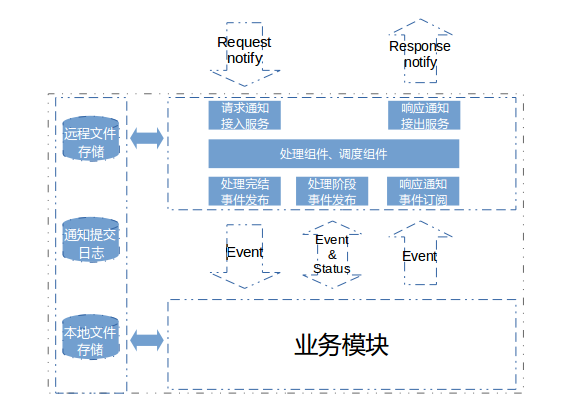
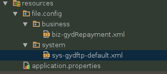

# 文件前置组件

## 1 使用场景
涉及到ftp服务交互使用，作为ftp服务前置组件使用：

+ 文件通知服务接入、持久化
+ 通知调用业务任务逻辑及业务逻辑回调
+ 业务任务完成任务后响应通知
+ 响应通知持久化、服务推送
+ 重试处理

## 2 组件+业务结构


## 3 开始接入使用

> maven依赖
```
<dependency>
    <groupId>com.yiji.adk</groupId>
    <artifactId>filefront</artifactId>
    <version>adkVersion</version>
</dependency>
```

> 表定义

执行：filefront classpath:/script/filefront.oracle.ddl.sql或者filefront.mysql.ddl.sql(没测)


> 配置

+ yiji.adk.filefront.enable=true 启用filefront
+ yiji.adk.filefront.ftp.server=gyd>gyd/gyd123@192.168.52.188:21| 写ftp配置 
+ yiji.adk.filefront.ftpRead.server=gyd>gyd/gyd123@192.168.52.188:21| 读ftp配置
+ yiji.adk.filefront.enableProvider=true 启用默认服务，如果不启用，业务可以自己实现请求和推送服务

> 通知及响应服务接口

com.yiji.adk.api.service.FileNotifyService

## 4 请求通知

+ filefront接收、验证、持久化、下载文件后，发出事件：RequestFileNotifyDownloadedEvent，用于业务监听此事件用于触发业务job
+ 业务job执行完后，发送事件：RequestFileNotifyParsedEvent，用于文件已解析后，回调filefront


## 5 响应通知

+ 业务job生成文件后，发出事件：ResponseFileNotifyPreparedEvent，用于业务通知filefront，文件已准备
+ filefront上传文件、通知外部成功后，发出事件：ResponseFileNotifyFinishedEvent，用于filefront回调业务响应成功

## 6 可用组件

> 配置工具（ftp系统及业务配置管理）

类：com.yiji.adk.filefront.support.config.FileConfigParser。通过spring注入后，可以使用，用于xml配置信息处理

xml 配置示例（文件路径可根据FilefrontProperties属性自定义，业务配置元素可自定义，系统配置元需必须以filefront定义为准）：



1、system配置用于配置filefront系统相关内容（sys-开头，-default或者-profile结尾）：

```
<!-- bizType业务类型，direction：方向（assemble/parse），tenant租户 -->
<fileConfig bizType="gydftp" direction="none" tenant="gyd">

    <system fileService="ftp">
        <server>
            <transport>
                <ftp passive="true" charset="UTF-8" soTimeout="60000" recvBuffer="4096" sendBuffer="4096"
                     soLinger="false" soLingerTime="-1" tcpNoDelay="false"/>
            </transport>
        </server>

        <path>
            <assembleLocalPath>/home/www-data/appdata/assemble/guiyindai</assembleLocalPath>
            <download isDownload="true">/home/www-data/appdata/download/guiyindai</download>
            <upload isUpload="true">/bornUpload</upload>
        </path>
    </system>

</fileConfig>
```

2、business配置用于业务自定义配内容（biz-开头）：

```
<!-- bizType业务类型，direction：方向（assemble-组装文件/parse-解析文件），tenant租户,用于区分空间 -->
<fileConfig bizType="gydRepaymentFromBank" direction="parse" tenant="gyd">

    <system extends="true" fileService="ftp">
    </system>

    <!-- 业务配置 -->
    <business>
        <file splitter="|" suffix=".txt" mode="detail" encoding="GBK" endWithSplitter="true">
            <keys>
                loanNo|realRepayAmount|realRepayPrincipal|realRepayInterest|phase|tradeDate
            </keys>
            <idempotency>loanNo</idempotency>
            <fromReqNotifyData>batchNo|bizType</fromReqNotifyData>
        </file>
    </business>

</fileConfig>

or

<fileConfig bizType="gydRepaymentToBank" direction="assemble" tenant="gyd">

    <system extends="true" fileService="ftp">
    </system>

    <!-- 业务配置 -->
    <business>
        <file splitter="|" suffix=".txt" hasHeader="false" mode="detail" encoding="GBK" namePrefix="BORN_LOAN_"
              endWithSplitter="true">
            <keys>bizType|loanNo|repayAmount</keys>
        </file>
    </business>

</fileConfig>
```

> 函数解析(用于业务自定义业务规则支持)

+ 解析工具类：com.yiji.adk.filefront.support.function.FunctionFactory
+ 函数标识接口（业务实现）：com.yiji.adk.filefront.support.function.ConvertFunction

> 重试支持

请求通知及响应通知支持重试，需要的在schedule配置吧，dubboGroup及dubboVersion由FilefrontProperties属性配置

